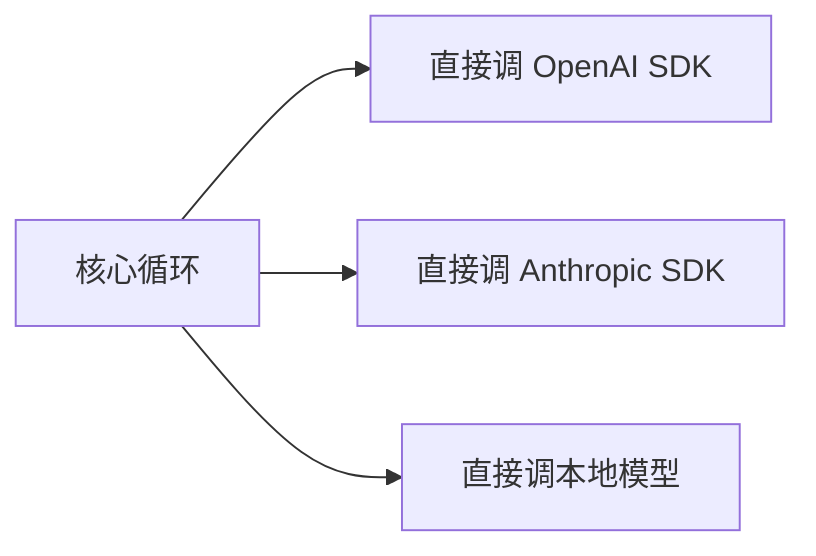

# 第 ③ 站：模型层

> Agent 的所有智能都来自模型调用。这一站讲清楚 LLMClient 端口怎么设计、流式回调怎么工作、缓存边界是什么、定价模型怎么算。

---

## 问题：模型调用为什么需要抽象？



如果核心循环直接调各个 SDK：
- 换模型要改核心代码
- 测试要连真实 API
- 每个 SDK 的接口格式不同，适配逻辑散落在各处
- 流式输出、工具调用、缓存的处理方式各不相同

prodagent 的解法：**一个 LLMClient Protocol，所有模型适配器实现它。**

---

## LLMClient 端口

```python
@runtime_checkable
class LLMClient(Protocol):
    async def complete(
        self,
        messages: MessageList,
        *,
        system: str | list[dict[str, Any]] = "",
        tools: list[dict[str, Any]] | None = None,
        config: LLMConfig | None = None,
        on_chunk: Callable[[str], Awaitable[None]] | None = None,
    ) -> LLMResponse: ...
```

**就一个方法：`complete`。** 所有模型适配器（OpenAI、Anthropic、Fake、本地模型）都实现这个接口。

核心循环只知道"调用 `complete`，拿到 `LLMResponse`"，不知道底层是 OpenAI 还是 Anthropic。

---

## LLMResponse：统一的返回格式

不同模型的返回格式千差万别。prodagent 把它们统一成 `LLMResponse`：

```python
@dataclass
class LLMResponse:
    content: str                          # 文本输出
    tool_calls: list[ToolCall]            # 请求的工具调用
    stop_reason: StopReason               # end_turn / tool_calls / max_tokens
    input_tokens: int                     # 输入 token 数
    output_tokens: int                    # 输出 token 数
    total_tokens: int                     # 总计
    cache_read_tokens: int = 0            # 缓存命中的 token
    cache_write_tokens: int = 0           # 写入缓存的 token
    reasoning_content: str = ""           # 思维链（如果模型支持）
    model: str = ""                       # 实际使用的模型
    from_cache: bool = False              # 是否来自语义缓存
```

**适配器的工作**：把各 SDK 的原生返回转换成这个统一格式。比如：
- OpenAI 的 `choices[0].message.tool_calls` → `tool_calls`
- Anthropic 的 `content_blocks` 中的 `tool_use` → `tool_calls`
- OpenAI 的 `usage.prompt_tokens_details.cached_tokens` → `cache_read_tokens`

这样核心循环不需要知道"OpenAI 的缓存字段叫什么、Anthropic 的叫什么"。

---

## 流式回调：on_chunk

```python
async def _call_llm(self, run, system, messages, tools):
    token_events = []
    async def _on_chunk(text: str):
        await _fire(self._bus, HookEvent.THINK, text=text, run_id=run.run_id)
        token_events.append(ThinkTokenEvent(token=text, run_id=run.run_id))

    response = await self._llm.complete(
        messages, system=system, tools=tools, config=llm_config, on_chunk=_on_chunk
    )
    return response, token_events
```

`on_chunk` 是一个异步回调，每收到一个 token 就触发一次。用途：

1. **实时输出** — 前端打字机效果，用户不用等完整响应
2. **思维链记录** — 支持 reasoning 的模型（Claude、DeepSeek-R1），把思考过程实时记录到 span
3. **事件驱动** — 触发 THINK 事件，可观测系统可以实时展示

**为什么用回调而不是 async generator？**
- `complete` 返回完整的 `LLMResponse`（包含 token 统计、工具调用），这是循环逻辑需要的
- 流式 token 通过回调实时传出，不影响返回值的结构
- 适配器可以自由选择是否实现流式（FakeLLM 可以一次性触发所有 chunk）

---

## LLMConfig：配置 + 定价

```python
@dataclass
class LLMConfig:
    model: str = ""
    temperature: float = 0.0
    max_tokens: int = 8_192
    timeout_seconds: float = 60.0
    enable_prompt_caching: bool = True
    cost_per_million_input: float = 0.0
    cost_per_million_output: float = 0.0
    cache_read_discount: float = 0.1     # Anthropic 0.1, OpenAI 0.5
    cache_write_premium: float = 1.25    # Anthropic 1.25
    cache_boundary_index: int | None = None
```

### 自动填充定价

```python
def __post_init__(self):
    if not self.model:
        from prodagent.llm.providers import detect_default_model
        self.model = detect_default_model()
    if self.cost_per_million_input == 0.0 and self.cost_per_million_output == 0.0:
        from prodagent.llm.pricing import pricing_for_model
        table = pricing_for_model(self.model)
        if table is not None:
            self.cost_per_million_input = table.input_rate_per_million
            self.cost_per_million_output = table.output_rate_per_million
```

**设计意图**：用户只需要指定模型名，定价自动从内置定价表填充。这样 cost 预算轴默认就是活的——不需要用户手动配置价格。

显式设置的价格永远优先；未知模型（包括 FakeLLM）定价为 0，cost 轴自动失效，不影响其他三轴。

### 成本计算

```python
def cost_for_response(self, response: LLMResponse) -> float:
    pricing = PricingTable(
        input_rate_per_million=self.cost_per_million_input,
        output_rate_per_million=self.cost_per_million_output,
        cache_read_discount=self.cache_read_discount,
        cache_write_premium=self.cache_write_premium,
    )
    return token_cost_usd(response, pricing)
```

```python
def token_cost_usd(response, pricing):
    cache_read = response.cache_read_tokens or 0
    cache_write = response.cache_write_tokens or 0
    input_billed = max(0, response.input_tokens - cache_read - cache_write)
    return (
        input_billed / 1e6 * pricing.input_rate
        + response.output_tokens / 1e6 * pricing.output_rate
        + cache_read / 1e6 * pricing.input_rate * pricing.cache_read_discount
        + cache_write / 1e6 * pricing.input_rate * pricing.cache_write_premium
    )
```

**四类 token 四种价格**：
- 普通输入：全价
- 输出：全价（通常比输入贵）
- cache_read：折扣价（Anthropic 0.1x，OpenAI 0.5x）
- cache_write：溢价（Anthropic 1.25x）

这就是为什么预算的 token 轴用 `billable_tokens = total - cache_read`——cache_read 几乎不花钱，不该占用预算额度。

---

## 缓存边界：cache_boundary_index

```python
if llm_config is not None and self._cache_boundary is not None:
    llm_config = dataclasses.replace(
        llm_config, cache_boundary_index=self._cache_boundary()
    )
```

**这是什么？** Anthropic 的 prompt caching 需要在消息中标记"从这里开始可以缓存"。`cache_boundary_index` 告诉适配器在哪个消息位置插入 `cache_control` 标记。

**为什么需要这个？** 因为系统提示和工具定义是每轮不变的，把它们标记为可缓存可以大幅降低成本。但缓存标记的位置需要动态计算（上下文压缩后消息列表会变），所以由 ContextManager 提供 `cache_boundary_index`，Step 在调用模型前注入。

```
messages = [
    {"role": "system", "content": "..."},     ← cache_boundary 标记在这里
    {"role": "user", "content": "任务..."},
    {"role": "assistant", "content": "..."},
    ...
]
```

---

## FakeLLM：精确可复现的测试模型

这是 prodagent 工程化的关键。1,182 个测试全部用 FakeLLM，零 API key、零网络。

```python
# 方式 1：预设响应序列
fake_llm = FakeLLMAdapter(responses=[
    LLMResponse(tool_calls=[{"name": "search", "params": {"query": "..."}}]),
    LLMResponse(content="最终答案", stop_reason="end_turn"),
])

# 方式 2：script 装饰器
@script
def my_scenario():
    yield LLMResponse(tool_calls=[...])  # 第 1 轮
    yield LLMResponse(content="...")      # 第 2 轮
```

**FakeLLM 能模拟什么？**
- 多轮工具调用序列
- 流式输出（逐 token 触发 on_chunk）
- 缓存命中（`from_cache=True`）
- 错误响应（超时、格式错误）
- 推理内容（`reasoning_content`）

**为什么这很重要？** 因为 Agent 的行为是多轮的、有状态的。用真实 API 测试会遇到：
- 非确定性（同样的输入可能得到不同输出）
- 速率限制
- 成本（1,182 个测试跑一次可能花几十美元）
- 慢（每个测试等几秒到几十秒）

FakeLLM 让测试**确定性、零成本、毫秒级完成**。

---

## 模型路由：按需选择

```python
# 环境变量配置，代码零修改
# USE_FAKE_LLM=1 → 用 FakeLLM
# LLM_BASE_URL + LLM_API_KEY + LLM_MODEL → 任意 OpenAI 兼容端点
# ANTHROPIC_API_KEY → Anthropic 原生
```

prodagent 不绑定特定模型。你可以：
- 开发时用 FakeLLM，完全离线
- 测试时用 FakeLLM，确定性可复现
- 生产时用 DeepSeek/Qwen/Moonshot（OpenAI 兼容），便宜
- 需要高质量时用 Claude/GPT-4

核心代码不需要任何改动，只改环境变量或配置。

---

## 适配器的工作量

实现一个新模型适配器需要做什么？

1. 实现 `LLMClient.complete()` 一个方法
2. 把 SDK 的返回转换成 `LLMResponse`
3. 处理流式输出（如果 SDK 支持）
4. 处理工具调用格式转换
5. 处理 token 统计和缓存字段

通常 100-200 行代码。不需要继承任何基类，不需要导入框架的任何东西（除了类型定义）。

---

## 代码定位

| 内容 | 源码位置 |
|------|---------|
| LLMClient 端口 | `ports/llm.py` |
| LLMConfig / PricingTable | `ports/llm.py` |
| 成本计算 | `ports/llm.py::token_cost_usd` |
| OpenAI 适配器 | `llm/openai.py` |
| Anthropic 适配器 | `llm/anthropic.py` |
| FakeLLM | `llm/fake.py` |
| 定价表 | `llm/pricing.py` |
| 模型自动检测 | `llm/providers.py` |

---

## 下一步

👉 **[第 ④ 站：工具系统 →](04-tools.md)** — `@tool` 装饰器怎么工作？参数校验、工具幻觉防御、只读并行/写串行。
