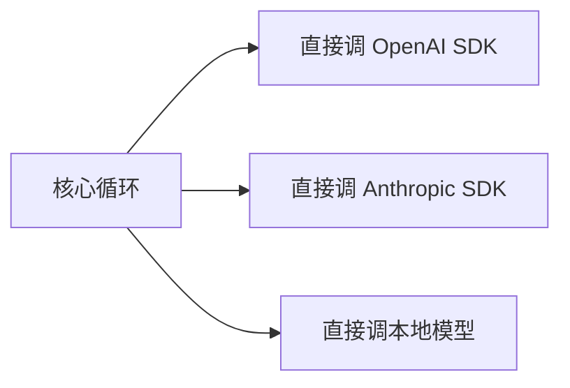
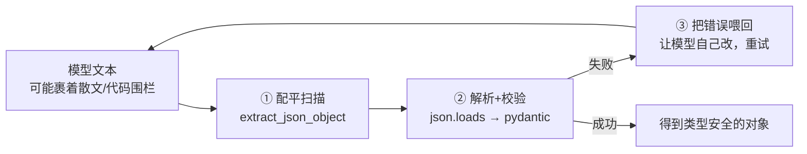

# 第 ③ 站：模型层

> Agent 的所有智能都来自模型调用。这一站讲清楚 LLMClient 端口怎么设计、流式回调怎么工作、缓存边界是什么、定价模型怎么算。

---

## 问题：模型调用为什么需要抽象？



如果核心循环直接调各个 SDK：
- 换模型要改核心代码
- 测试要连真实 API
- 每个 SDK 的接口格式不同，适配逻辑散落在各处
- 流式输出、工具调用、缓存的处理方式各不相同

prodagent 的解法：**一个 LLMClient Protocol，所有模型适配器实现它。**

---

## LLMClient 端口

```python
@runtime_checkable
class LLMClient(Protocol):
    async def complete(
        self,
        messages: MessageList,
        *,
        system: str | list[dict[str, Any]] = "",
        tools: list[dict[str, Any]] | None = None,
        config: LLMConfig | None = None,
        on_chunk: Callable[[str], Awaitable[None]] | None = None,
    ) -> LLMResponse: ...
```

**就一个方法：`complete`。** 所有模型适配器（OpenAI、Anthropic、Fake、本地模型）都实现这个接口。

核心循环只知道"调用 `complete`，拿到 `LLMResponse`"，不知道底层是 OpenAI 还是 Anthropic。

---

## LLMResponse：统一的返回格式

不同模型的返回格式千差万别。prodagent 把它们统一成 `LLMResponse`：

```python
@dataclass
class LLMResponse:
    content: str                              # 文本输出
    tool_calls: list[ToolCall] = field(default_factory=list)  # 请求的工具调用
    stop_reason: StopReason = StopReason.END_TURN
    input_tokens: int = 0                     # 输入 token 数
    output_tokens: int = 0                    # 输出 token 数
    model: str = ""                           # 实际使用的模型名
    cache_read_tokens: int = 0                # 缓存命中的 token
    cache_write_tokens: int = 0               # 写入缓存的 token
    reasoning_content: str = ""               # 思维链纯文本投影
    thinking_blocks: list[dict] = field(default_factory=list)  # 原始思维块（含签名）
    from_cache: bool = False                  # 是否由缓存客户端直接返回

    @property
    def total_tokens(self) -> int:            # property，不是 dataclass 字段
        return self.input_tokens + self.output_tokens
```

**适配器的工作**：把各 SDK 的原生返回转换成这个统一格式。比如：
- OpenAI 的 `choices[0].message.tool_calls` → `tool_calls`
- Anthropic 的 `content_blocks` 中的 `tool_use` → `tool_calls`
- OpenAI 的 `usage.prompt_tokens_details.cached_tokens` → `cache_read_tokens`

这样核心循环不需要知道"OpenAI 的缓存字段叫什么、Anthropic 的叫什么"。

**一个容易踩的口径坑**：`input_tokens` 在 canonical 格式里是**全包含**的（含缓存 token），但两家 provider 的原生口径相反——Anthropic 的 `usage.input_tokens` **不含**缓存 token（要自己加上 `cache_read/cache_write`），OpenAI 的 `prompt_tokens` **已经含**缓存 token。适配器负责把两种口径都折算成"全包含"，下游的成本公式才能从同一个基数里减掉缓存行（缓存的折扣价/溢价价）。如果你写自己的适配器，这里算错一个方向，预算的成本轴就会系统性偏差。

**StopReason 以 Anthropic 词汇为规范**：

| 值 | 字符串 | 含义 |
|---|---|---|
| `END_TURN` | `"end_turn"` | 模型自然结束 |
| `TOOL_USE` | `"tool_use"` | 模型请求调用工具 |
| `MAX_TOKENS` | `"max_tokens"` | 输出被截断 |
| `CONTENT_FILTER` | `"content_filter"` | 被安全过滤 |

未知的 provider 特定值会通过 `StopReason.coerce()` 映射为 `END_TURN`，不会让调用方崩溃。

---

## 流式回调：on_chunk

```python
async def _call_llm(self, run, system, messages, tools):
    token_events = []
    async def _on_chunk(text: str):
        await _fire(self._bus, HookEvent.THINK, text=text, run_id=run.run_id)
        token_events.append(ThinkTokenEvent(token=text, run_id=run.run_id))

    response = await self._llm.complete(
        messages, system=system, tools=tools, config=llm_config, on_chunk=_on_chunk
    )
    return response, token_events
```

`on_chunk` 是一个异步回调，每收到一个 token 就触发一次。用途：
1. **实时输出** — 前端打字机效果，用户不用等完整响应
2. **思维链记录** — 支持 reasoning 的模型（Claude、DeepSeek-R1），把思考过程实时发出
3. **事件驱动** — 触发 `llm.think` 事件，可观测系统可以实时展示

**为什么用回调而不是 async generator？**
- `complete` 返回完整的 `LLMResponse`（包含 token 统计、工具调用），这是循环逻辑需要的
- 流式 token 通过回调实时传出，不影响返回值的结构
- 适配器可以自由选择是否实现流式（FakeLLM 按词触发 chunk）

---

## LLMConfig：配置 + 定价

`LLMConfig` 定义在 `ports/llm.py`（从 `prodagent.llm` 重导出），是端口契约的一部分：

```python
@dataclass
class LLMConfig:
    model: str = ""                          # 空则自动检测默认模型
    temperature: float = 0.0
    max_tokens: int = 8_192
    timeout_seconds: float = 60.0
    enable_prompt_caching: bool = True
    thinking_budget_tokens: int = 0          # >0 开启扩展推理（Anthropic thinking）
    cost_per_million_input: float = 0.0      # 0 则自动从定价表填充
    cost_per_million_output: float = 0.0
    cache_read_discount: float = 0.1         # Anthropic 0.1x, OpenAI 0.5x
    cache_write_premium: float = 1.25        # Anthropic 1.25x
    cache_boundary_index: int | None = None  # 提示缓存标记位置
```

### thinking_budget_tokens：扩展推理

当 `thinking_budget_tokens > 0` 时，Anthropic 适配器启用 extended thinking：
- 停止发送 `temperature`（API 在 thinking 开启时固定为 1）
- 保持 `max_tokens` 大于 thinking budget
- 原始 thinking blocks（含签名）随 assistant 消息往返——Anthropic API 要求 tool-use 续传时必须带上前一条消息的 thinking blocks，否则报错

### 自动填充定价

```python
def __post_init__(self):
    if not self.model:
        from prodagent.llm.providers import detect_default_model
        self.model = detect_default_model()
    if self.cost_per_million_input == 0.0 and self.cost_per_million_output == 0.0:
        from prodagent.llm.pricing import pricing_for_model
        table = pricing_for_model(self.model)
        if table is not None:
            self.cost_per_million_input = table.input_rate_per_million
            self.cost_per_million_output = table.output_rate_per_million
```

**设计意图**：用户只需要指定模型名，定价自动从内置定价表填充。这样 cost 预算轴默认就是活的——不需要用户手动配置价格。

显式设置的价格永远优先；未知模型（包括 FakeLLM）定价为 0，cost 轴自动失效，不影响其他三轴。

### 成本计算

```python
def token_cost_usd(response, pricing):
    cache_read = response.cache_read_tokens or 0
    cache_write = response.cache_write_tokens or 0
    input_billed = max(0, response.input_tokens - cache_read - cache_write)
    return (
        input_billed / 1e6 * pricing.input_rate_per_million
        + response.output_tokens / 1e6 * pricing.output_rate_per_million
        + cache_read / 1e6 * pricing.input_rate_per_million * pricing.cache_read_discount
        + cache_write / 1e6 * pricing.input_rate_per_million * pricing.cache_write_premium
    )
```

**四类 token 四种价格**：
- 普通输入：全价
- 输出：全价（通常比输入贵）
- cache_read：折扣价（Anthropic 0.1x，OpenAI 0.5x）
- cache_write：溢价（Anthropic 1.25x）

这就是为什么预算的 token 轴用 `billable_tokens = total - cache_read`——cache_read 几乎不花钱，不该占用预算额度。

---

## 缓存边界：cache_boundary_index

**这是什么？** Anthropic 的 prompt caching 需要在消息中标记"从这里开始可以缓存"。`cache_boundary_index` 告诉适配器在哪个消息位置插入 `cache_control` 标记。

**为什么需要这个？** 因为系统提示和工具定义是每轮不变的，把它们标记为可缓存可以大幅降低成本。但缓存标记的位置需要动态计算（上下文压缩后消息列表会变），所以由 ContextManager 提供 `cache_boundary_index`，Step 在调用模型前注入。

```
messages = [
    {"role": "system", "content": "..."},     ← cache_boundary 标记在这里
    {"role": "user", "content": "任务..."},
    {"role": "assistant", "content": "..."},
    ...
]
```

`enable_prompt_caching=False` 时，适配器不发送任何缓存标记。

---

## 传输层重试：一条看不见的守卫

网络会闪断、provider 会限流。`llm/http_retry.py` 在适配器之下包了一层传输重试：可重试的状态码（429/5xx）和传输异常按 jittered backoff 重试，`Retry-After` 头优先；永久错误（400/401/403…）立刻上抛，绝不浪费一次重试。

这里最有教学价值的设计是 **DeliveryGuard（半交付守卫）**：

> 一旦流式输出的第一个 chunk 已经交给了消费者，传输中途失败就**不再透明重试**——重试会把已交付的前缀再放一遍。

```python
guard = DeliveryGuard()

async def _guarded_chunk(text: str) -> None:
    guard.mark()          # 第一笔交付，标记"已经出去了"
    await on_chunk(text)

await with_http_retry(
    lambda: self._stream(..., on_chunk=_guarded_chunk),
    stream_guard=guard,   # 失败时检查：交付过 → 直接上抛
)
```

为什么不能重试？重试解决的是"调用失败、什么都没发生"；而半交付失败时**用户已经看到了前半段**。重放会得到重复的前缀，UI 上是灾难，语义上是"一条消息变两条"。所以这里的正确行为是把失败暴露给上层，让上层决定（重新组织一次完整调用，或干脆报错）。

"重试"不是一个开关，而是一组按后果分级的选择：什么都没发生 → 可以透明重试；发生了一半 → 必须显式处理。这个区分在分布式系统里叫幂等性边界，在 Agent 框架里同样成立。

---

## FakeLLM：精确可复现的测试模型

这是 prodagent 工程化的关键。框架的 1,300+ 个测试全部用 FakeLLM，零 API key、零网络。

```python
from prodagent.kernel.types import LLMResponse, StopReason, ToolCall
from prodagent.llm.fake import FakeLLMAdapter, script, RoutingFakeLLM

# 方式 1：预设响应序列（FIFO，每轮 complete() 消费一个）
fake_llm = FakeLLMAdapter(responses=[
    LLMResponse(
        content="",
        tool_calls=[ToolCall(name="search", params={"query": "巴黎天气"})],
        stop_reason=StopReason.TOOL_USE,
    ),
    LLMResponse(content="巴黎今天晴，25°C。", stop_reason=StopReason.END_TURN),
])

# 方式 2：script() 工厂函数——更简洁的多轮脚本
fake_llm = script(
    {"tool": "search", "params": {"query": "巴黎天气"}},
    {"content": "巴黎今天晴，25°C。"},
)

# 方式 3：RoutingFakeLLM——多 Agent 场景按 Agent 名称路由
fake = RoutingFakeLLM()
fake.add("researcher", [LLMResponse(content="研究结果...")])
fake.add("writer", [LLMResponse(content="写作结果...")])
# 也可以按 system prompt 子串路由
fake.add_route("Planner", [LLMResponse(content="计划...")])
```

**FakeLLM 能模拟什么？**
- 多轮工具调用序列（FIFO 队列）
- 流式输出（按词触发 on_chunk）
- 延迟模拟（`latency_ms` 参数）
- 基于消息历史的动态响应（队列中可以放 callable）
- 推理内容（`reasoning_content`）

**为什么这很重要？** 因为 Agent 的行为是多轮的、有状态的。用真实 API 测试会遇到：
- 非确定性（同样的输入可能得到不同输出）
- 速率限制
- 成本（1,300+ 个测试跑一次可能花几十美元）
- 慢（每个测试等几秒到几十秒）

FakeLLM 让测试**确定性、零成本、毫秒级完成**。

---

## 结构化输出：让模型稳定吐出 JSON
你让模型"只返回一个 JSON 对象"，它却常常回你一句"好的，结果如下："再附上一段 ```json 代码块，甚至在 JSON 外面裹一层解释文字。如果直接 `json.loads(response.content)`，这些"不听话"的输出会让程序当场报错。prodagent 用**三层防线**把这件事做稳：



**第一道：配平扫描，而不是正则。** `extract_json_object` 先剥掉 markdown 围栏，然后从第一个 `{` 或 `[` 开始逐个字符扫描，用一个深度计数器找到**第一个括号配平**的片段。这里有两个小白容易忽略、但缺一不可的细节：要正确处理字符串内部出现的括号（字符串里的 `{` 不能计数），还要处理转义符 `\`。这也是为什么**不能用一个正则去"匹配 JSON"**——JSON 可以任意嵌套，正则处理不了嵌套层级。

**第二道：解析 + 校验。** `parse_json_as` 把"提取 → `json.loads` → pydantic `model_validate`"串成三步，任何一步失败都统一成 `StructuredOutputError`，而不是把三种不同的异常漏给上层。

> **小白加餐：pydantic 是什么？** 它是一个"用类型注解做运行时校验"的库：你声明一个类（字段名、类型、约束），把字典丢给 `model_validate`，它要么返回一个类型安全的对象，要么精确告诉你哪个字段不对。等于让 Python 这种动态语言在"系统边界处"拥有了静态校验。

**第三道：把错误当成反馈，让模型自我修正。** 最体现设计思想的是 `complete_structured`：校验失败时它**不抛给用户、也不放弃**，而是把上一轮回答和校验错误一起追加回对话，补一句"你上次的输出没通过校验，这是错误原因，请只返回符合 schema 的 JSON"，然后重试（默认 2 次）。你会发现这和[工具错误返回结构化结果而不是抛异常](../decisions.md)是同一种哲学——**模型会犯错，这是常态；框架要做的是给它"看着错误改正"的机会，而不是让整个循环崩掉。**

---

## 模型路由：按需选择

```python
# 环境变量配置，代码零修改
# USE_FAKE_LLM=1 → 用 FakeLLM
# LLM_BASE_URL + LLM_API_KEY + LLM_MODEL → 任意 OpenAI 兼容端点
# ANTHROPIC_API_KEY → Anthropic 原生
```
**选择有确定的优先级**：Fake > OpenAI 兼容 > Anthropic 原生 > Fake 兜底（见 `llm/providers.py`）。注意一个刻意的设计——**框架不内置任何厂商清单**：它不关心你的 `LLM_BASE_URL` 指向 DeepSeek、Qwen、Moonshot 还是你自建的 vLLM 网关，"端点归你所有，框架不站队"。这样新增一家模型厂商时，框架一行代码都不用改。这也是端口思维在模型层的延续：**变化最频繁的东西（厂商、模型名、价格），用配置和数据承载，而不是用代码分支承载。**

prodagent 不绑定特定模型。你可以：
- 开发时用 FakeLLM，完全离线
- 测试时用 FakeLLM，确定性可复现
- 生产时用 DeepSeek/Qwen/Moonshot（OpenAI 兼容），便宜
- 需要高质量时用 Claude/GPT-4

核心代码不需要任何改动，只改环境变量或 `LLMConfig`。

---

## 适配器的工作量

实现一个新模型适配器需要做什么？
1. 实现 `LLMClient.complete()` 一个方法
2. 把 SDK 的返回转换成 `LLMResponse`（含 ToolCall、StopReason、token 统计）
3. 处理流式输出（如果 SDK 支持），逐 token 调用 `on_chunk`
4. 处理工具调用格式转换（SDK 格式 ↔ 框架的 JSON schema 格式）
5. 处理提示缓存标记（如果模型支持）
6. 处理 thinking blocks 的往返（如果支持扩展推理）

通常 100-200 行代码。不需要继承任何基类，不需要导入框架的任何东西（除了类型定义）。

---

## 代码定位

| 内容 | 源码位置 |
|------|---------|
| LLMClient 端口 + LLMConfig + PricingTable | `ports/llm.py` |
| 成本计算 `token_cost_usd` | `ports/llm.py` |
| OpenAI 兼容适配器 | `llm/openai_adapter.py` |
| Anthropic 适配器 | `llm/anthropic_adapter.py` |
| FakeLLM / script / RoutingFakeLLM | `llm/fake.py` |
| 缓存客户端 | `llm/cache.py` |
| 定价表 | `llm/pricing.py` |
| 模型自动检测 | `llm/providers.py` |
| 结构化输出（配平扫描/校验/自纠重试） | `llm/structured_output.py` |

---

## 下一步

👉 **[第 ④ 站：工具系统 →](04-tools.md)** — `@tool` 装饰器怎么工作？参数校验、工具幻觉防御、只读并行/写串行。
