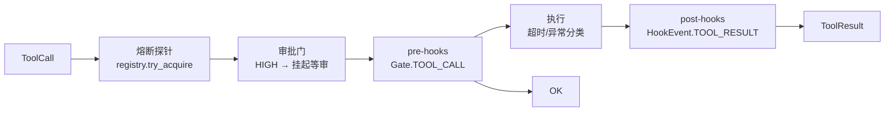

# ④ 工具 tooling

一个工具的全部声明面：

```python
from prodagent import tool
from prodagent.core.types import SideEffectLevel, ToolMeta

@tool(name="place_order", meta=ToolMeta(
    name="place_order",
    side_effect_level=SideEffectLevel.HIGH,   # ← 这一个词决定它要不要过审批门
    timeout_seconds=30.0,
))
async def place_order(item: str, qty: int) -> dict:
    """下单。"""            # docstring 进 schema，模型读的就是它
    return {"ordered": item, "qty": qty}
```

装饰器（`tooling/decorator.py:55`）从函数签名生成 JSON Schema、从
docstring 生成描述、把类型标注收进 `ToolMeta`。**元数据不是注释**：
`side_effect_level` 在下一站决定工具是否触发审批挂起，在本站决定
它能否并发。

## 分发管道：probe → 门 → 前钩 → 执行 → 后钩

`ToolDispatcher.dispatch`（`tooling/dispatcher.py:285`）是每一次工具
调用的必经之路，五个关卡按固定顺序：



- **探针**：工具注册表（`tooling/registry.py:19`）带每工具熔断器
  （CLOSED→OPEN→HALF_OPEN），连续失败后新调用直接得到
  `circuit_open`，不执行。零配置时不参与——只有传入 `tool_registry=`
  才激活。
- **审批门**：`SideEffectLevel.HIGH` 的工具在此被拦下，run 进入
  `SUSPENDED`，`pending_tool_call` 记住这次调用。人批了，恢复后重放的
  是**同一个调用**。细节在[审批](../topics/approval.md)。
- **前后钩**：挂进 hook 总线的卡位。span 导出、控制台卡片都坐在这里。

## 批执行：只读并行，写串行

循环每轮拿到一批 `tool_calls` 后交给 `run_batch`
（`tooling/dispatcher.py:110`），它按元数据分流：

```python
# tooling/dispatcher.py:120（节选）
readonly_calls: list[tuple[int, ToolCall]] = []
serial_calls: list[tuple[int, ToolCall]] = []
...
if readonly_calls:      # 信号量并发（LoopConfig.readonly_concurrency，默认 8）
    semaphore = asyncio.Semaphore(readonly_concurrency)
    raw = await asyncio.gather(*[_dispatch_with_cap(c) for _, c in readonly_calls],
                               return_exceptions=True)
for _, call in serial_calls:   # 有副作用的，严格按模型给出的顺序执行
    result = await self.dispatch_with_retry(call, run)
```

**为什么以 `readonly` 为分界而不是让用户标注并发性？** 因为副作用有序
是一条可以默认安全的不变量（重复执行同一个写是灾难），而只读并行
是纯收益。用户唯一可调的是并发上限。`dispatch_with_retry` 默认
`max_attempts=1`：静默重试一个可能已生效的写操作是惊吓，不是韧性——
要重试就显式给 `RetryPolicy`。

另一个安全细节：`meta.enforced_idempotent` 的工具，框架在调用前铸造
`idempotency_key`（`run_id:c{n}`）塞进参数——**框架只造钥匙，执行
幂等是工具的责任**。这是消息平面一讲的原则在工具层的回声。

## 取舍

**不把工具做成“插件/技能市场”式注册中心？** 注册表
（`ToolRegistry`）存在，但它解决的是**可用性检索**（分层的工具按需
检索进上下文），不是生态装配。工具就是一个 async 函数加一份元数据，
import 即用；先有函数再有生态，反过来就会得到一个装满同名工具的
目录和一场依赖地狱。

