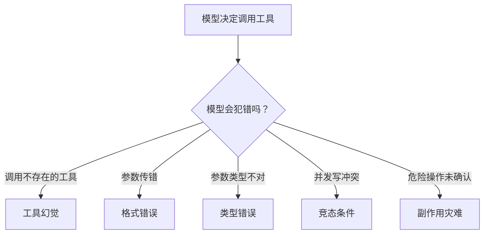
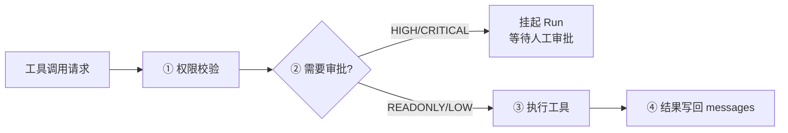

# 第 ④ 站：工具系统

> 工具是 Agent 与世界交互的手。这一站讲清楚 `@tool` 装饰器怎么工作、参数怎么校验、工具幻觉怎么防、只读并行/写串行怎么调度。

---

## 问题：工具调用为什么容易出问题？



模型不是程序员。它会：
- 调用一个不存在的工具（幻觉）
- 传错参数名（把 `query` 写成 `q`）
- 传错类型（把数字写成字符串）
- 同时调用两个有依赖关系的写工具
- 不经过确认就执行危险操作

工具系统的职责就是**防御这些错误，同时不让正常调用变慢**。

---

## @tool 装饰器：定义工具

```python
from prodagent import tool, SideEffectLevel

@tool(name="search", readonly=True)
async def search(query: str, max_results: int = 5) -> str:
    """搜索网络信息。

    Args:
        query: 搜索关键词
        max_results: 最多返回多少条结果
    """
    return f"results for: {query}"
```

装饰器做了什么？

1. **提取函数签名** — 参数名、类型、默认值
2. **生成 JSON Schema** — 传给模型的工具定义
3. **构建 TypeAdapter** — 每个参数的类型校验器（构建时缓存，运行时零开销）
4. **包装成 FunctionTool** — 统一的调用接口

### 工具元数据

```python
@dataclass
class ToolMeta:
    name: str
    description: str
    side_effect: SideEffectLevel = SideEffectLevel.LOW
    readonly: bool = False
    timeout: float | None = None
    tags: list[str] = field(default_factory=list)
```

| 字段 | 作用 |
|------|------|
| `name` | 工具名，模型通过这个名字调用 |
| `description` | 工具描述，模型根据这个决定要不要调用 |
| `side_effect` | 副作用等级，决定是否需要审批 |
| `readonly` | 是否只读，决定能否并行执行 |
| `timeout` | 单工具超时 |
| `tags` | 标签，用于工具检索和权限分组 |

---

## 参数校验：构建时缓存，运行时零开销

```python
class FunctionTool:
    def __init__(self, name, fn, meta, schema, *, inject_run_id=False):
        self._adapters = _build_adapters(fn, name)  # 构建时缓存
        self._cache_signature(fn)                    # 缓存参数列表

    def _coerce_params(self, kwargs):
        if not self._adapters:
            return kwargs
        coerced = dict(kwargs)
        for param_name, adapter in self._adapters.items():
            if param_name not in coerced:
                continue
            try:
                coerced[param_name] = adapter.validate_python(val)
            except ValidationError:
                logger.warning(...)  # 校验失败不崩，传原始值让模型修正
        return coerced
```

**设计要点**：

1. **Pydantic TypeAdapter 逐参数构建** — 不是整个 dict 校验，而是每个参数单独校验。这样一个参数错了不会影响其他参数。

2. **校验失败不抛异常** — 记录 warning，把原始值传进去。为什么？因为工具函数本身可能能处理（比如 `int("5")` 自动转换），或者下一轮模型会修正。抛异常会打断循环，返回结构化错误更友好。

3. **unexpected/missing 参数检测**：
```python
if not self._has_var_keyword:
    unexpected = sorted(set(kwargs) - self._valid_params)
    missing = sorted(set(self._required_params) - set(kwargs))
    if unexpected or missing:
        return ToolResult.from_error(
            ToolError.from_reason(
                ErrorReason.FORMAT_ERROR,
                message=f"Tool '{self.name}' called with wrong parameters",
                hint=f"Valid parameters: {sorted(self._valid_params)}"
            )
        )
```

模型传错参数时，不抛异常，而是返回一个结构化的 `ToolResult`，里面包含错误信息和修正建议。模型在下一轮看到这个结果，会自己修正。

> **核心理念**：模型犯错是正常的，不是异常。给它反馈，让它修正，而不是打断整个循环。

---

## 工具幻觉防御

模型可能调用一个不存在的工具。ToolDispatcher 在调度前检查：

```python
def dispatch(self, tool_calls):
    for call in tool_calls:
        if call.name not in self._registry:
            yield ToolResult.from_error(
                ToolError.from_reason(
                    ErrorReason.TOOL_NOT_FOUND,
                    message=f"Tool '{call.name}' does not exist",
                    hint=f"Available tools: {list(self._registry.keys())}"
                )
            )
            continue
        tool = self._registry[call.name]
        # ... 执行
```

同样，返回结构化错误 + 可用工具列表，让模型自己修正。

---

## 调度策略：只读并行，写串行

```python
async def run_batch(self, run, tool_calls):
    readonly_calls = []
    write_calls = []
    for call in tool_calls:
        tool = self._registry[call.name]
        if tool.meta.readonly:
            readonly_calls.append(call)
        else:
            write_calls.append(call)

    # 只读工具并行执行
    if readonly_calls:
        results = await asyncio.gather(*[self._execute(c) for c in readonly_calls])
        for r in results:
            yield r

    # 写工具串行执行
    for call in write_calls:
        result = await self._execute(call)
        yield result
```

**为什么这样设计？**

| 类型 | 并行？ | 原因 |
|------|--------|------|
| 只读工具（搜索、查询、读取） | ✅ 并行 | 无副作用，不会互相干扰 |
| 写工具（发送、删除、修改） | ❌ 串行 | 可能有依赖关系和竞态条件 |

这是"安全优先"的默认策略。如果用户确定某些写工具可以并行，可以自定义 Dispatcher 覆盖。

---

## 执行前的关卡



### ① 权限校验

三层策略：
- **Agent 身份** — 这个 Agent 角色能不能调用这类工具？
- **工具权限** — 这个具体工具在当前上下文中是否被允许？
- **数据访问** — 工具参数中的资源（文件路径、数据库 ID）是否在授权范围内？

越权操作返回 `ToolResult.from_error(SecurityViolation)`，不抛异常。

### ② 审批门

`SideEffectLevel.HIGH` 及以上的工具，执行前挂起 Run：
```python
if tool.meta.side_effect >= SideEffectLevel.HIGH:
    run.pending_tool_call = call
    run.state = RunState.SUSPENDED
    yield RunSuspendedEvent(run=run)
    return  # 退出循环，等审批
```

审批通过后恢复时**直接执行 pending_tool_call**，不重新问 LLM。详细机制见 [HITL 审批专题 →](../topics/approval.md)。

### ③ 执行

- 同步/异步函数统一处理（`inspect.iscoroutinefunction` 判断）
- 超时控制（`asyncio.wait_for`）
- 异常捕获（工具抛异常不打断循环，转成 ToolError）

### ④ 结果写回

```python
msg = {"role": "tool", "tool_call_id": call.call_id, "content": str(result)}
run.messages.append(msg)
```

OpenAI 格式的 tool 消息，必须带 `tool_call_id` 与之前的 assistant 消息对应。

---

## 工具注册与检索

### 静态注册

```python
agent = Agent("demo", tools=[search, fetch, send_email])
```

简单直接，适合工具数量少（< 20 个）的场景。

### 动态语义检索

工具数量多时（> 50 个），把所有工具的 schema 都塞给模型会浪费 token。`tooling/search.py` 提供语义检索：

```python
# 根据当前任务语义检索最相关的 N 个工具
relevant_tools = await tool_search.search(task, top_k=10)
```

只把相关工具的 schema 传给模型，减少上下文长度和幻觉概率。

---

## 工具可靠性：重试与降级

`tooling/reliability/` 提供工具调用的可靠性增强：

| 机制 | 作用 |
|------|------|
| 重试 | 瞬时失败（网络超时、500）自动重试，指数退避 |
| 熔断 | 连续失败 N 次后暂时禁用该工具，避免浪费轮次 |
| 降级 | 工具不可用时返回友好错误，让模型换方案 |
| 超时 | 每个工具可单独设超时，防止一个工具卡死整个 Run |

这些都是可选的 wrapper，不影响核心工具逻辑。

---

## 与其他框架的对比

| 维度 | prodagent | LangChain |
|------|-----------|-----------|
| 工具定义 | `@tool` 装饰器，函数签名自动生成 schema | `@tool` 装饰器或 BaseTool 子类 |
| 参数校验 | Pydantic TypeAdapter 逐参数，失败返回错误 | Pydantic 模型校验，失败抛异常 |
| 幻觉处理 | 返回 ToolError + 可用工具列表，让模型修正 | 通常抛异常打断循环 |
| 并行策略 | 只读并行/写串行，可自定义 | 全部并行或全部串行 |
| 副作用等级 | 四级（READONLY/LOW/HIGH/CRITICAL） | 无内建概念 |
| 审批门 | HIGH 工具自动挂起 | 需要自己实现 |

---

## 代码定位

| 内容 | 源码位置 |
|------|---------|
| @tool 装饰器 | `tooling/decorator.py` |
| FunctionTool | `tooling/base.py` |
| ToolDispatcher | `tooling/dispatcher.py` |
| 工具注册 | `tooling/registry.py` |
| 工具语义检索 | `tooling/search.py` |
| 可靠性增强 | `tooling/reliability/` |
| 内置工具 | `tooling/builtin/` |
| 技能解析器 | `tooling/skill_resolver.py` |

---

## 下一步

👉 **[第 ⑤ 站：循环内核 →](05-loop.md)** — think→decide→execute 原子、14 层护甲、死循环检测。

或者深入 [HITL 审批专题 →](../topics/approval.md)，看审批挂起和增量重规划的完整设计。
