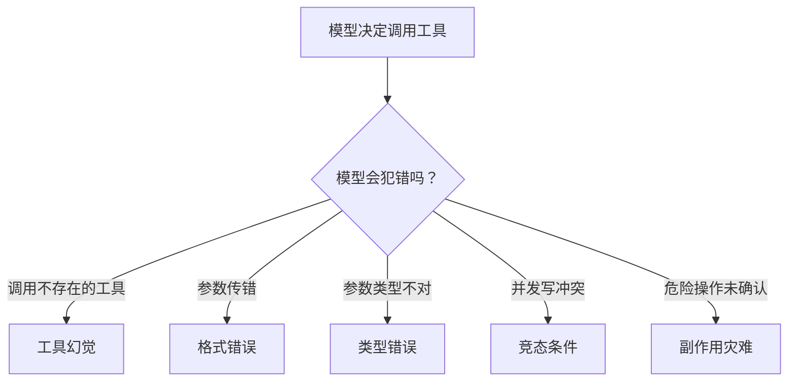
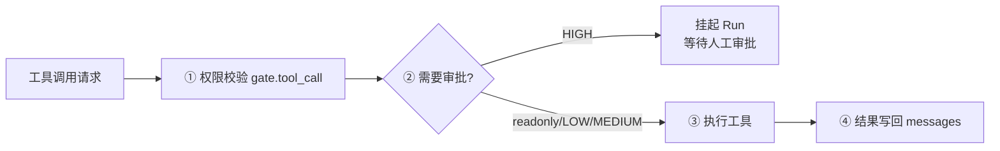
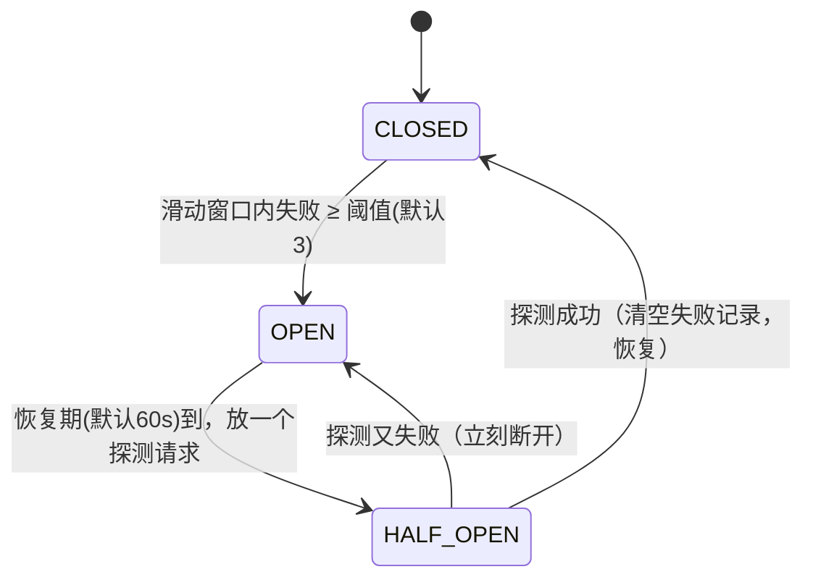

# 第 ④ 站：工具系统

> 工具是 Agent 与世界交互的手。这一站讲清楚 `@tool` 装饰器怎么工作、参数怎么校验、工具幻觉怎么防、只读并行/写串行怎么调度。

---

## 问题：工具调用为什么容易出问题？



模型不是程序员。它会：
- 调用一个不存在的工具（幻觉）
- 传错参数名（把 `query` 写成 `q`）
- 传错类型（把数字写成字符串）
- 同时调用两个有依赖关系的写工具
- 不经过确认就执行危险操作

工具系统的职责就是**防御这些错误，同时不让正常调用变慢**。

---

## @tool 装饰器：定义工具

```python
from prodagent import tool
from prodagent.kernel.types import SideEffectLevel, ToolMeta

# 只读工具——可以并行执行，不需要审批
@tool(name="search", readonly=True)
async def search(query: str, max_results: int = 5) -> str:
    """搜索网络信息。

    Args:
        query: 搜索关键词
        max_results: 最多返回多少条结果
    """
    return f"results for: {query}"

# 高副作用工具——通过 meta 设置副作用等级和超时
@tool(
    name="send_email",
    meta=ToolMeta(
        name="send_email",
        side_effect_level=SideEffectLevel.HIGH,
        timeout_seconds=30.0,
        domain="communication",
        enforced_idempotent=True,
    ),
)
async def send_email(to: str, body: str) -> str:
    """发送邮件给指定收件人。"""
    ...
```

装饰器做了什么？
1. **提取函数签名** — 参数名、类型、默认值
2. **生成 JSON Schema** — 传给模型的工具定义（Pydantic TypeAdapter）
3. **构建类型适配器** — 每个参数的校验器（构建时缓存，运行时零开销）
4. **包装成 FunctionTool** — 统一的调用接口

### @tool 参数

| 参数 | 类型 | 说明 |
|------|------|------|
| `name` | `str \| None` | 工具名（默认函数名） |
| `description` | `str \| None` | 工具描述（默认 docstring） |
| `readonly` | `bool` | 是否只读（隐含 LOW 副作用，可并行） |
| `meta` | `ToolMeta \| None` | 完整元数据（副作用等级、超时等） |

> **注意**：`@tool` 装饰器**没有** `side_effect`、`timeout`、`tags` 参数。要设置副作用等级或超时，通过 `meta=ToolMeta(...)` 传入。`readonly=True` 与 `side_effect_level=MEDIUM/HIGH` 互斥，会在装饰时抛 `ValueError`。

---

## ToolMeta：工具的静态元数据

```python
@dataclass
class ToolMeta:
    name: str
    is_readonly: bool = False
    side_effect_level: SideEffectLevel = SideEffectLevel.LOW
    enforced_idempotent: bool = False   # 框架注入 idempotency_key，工具函数必须接受它
    timeout_seconds: float = 10.0       # 硬超时，dispatcher 用 asyncio.wait_for 执行
    domain: str = "general"             # 领域标签，用于工具分组和检索
    max_result_chars: float = 100_000   # 结果最大字符数，超长自动截断
```

| 字段 | 作用 |
|------|------|
| `name` | 工具名，模型通过这个名字调用 |
| `is_readonly` | 是否只读，决定能否并行执行 |
| `side_effect_level` | 副作用等级（LOW/MEDIUM/HIGH），决定是否需要审批 |
| `enforced_idempotent` | 为 True 时框架注入幂等键，工具函数必须接受 `idempotency_key` 参数 |
| `timeout_seconds` | 单工具硬超时（默认 10 秒），是正确性边界而非预估值 |
| `domain` | 领域标签（如 "communication"、"finance"），用于语义检索 |
| `max_result_chars` | 结果最大字符数，防止超长结果撑爆上下文 |

工具的 **description** 不在 `ToolMeta` 上，而在 `FunctionTool` 上——它来自函数的 docstring 或 `@tool(description=...)` 参数。

### SideEffectLevel：副作用三级

```python
class SideEffectLevel(StrEnum):
    LOW = "low"
    MEDIUM = "medium"
    HIGH = "high"
```

| 等级 | 并行 | 审批 | 典型场景 |
|------|------|------|---------|
| `readonly=True`（只读） | ✅ 并行 | 不需要 | 查询、搜索、读取 |
| `LOW` | ❌ 串行 | 不需要 | 缓存写入、临时文件 |
| `MEDIUM` | ❌ 串行 | 不需要 | 非关键外部 API 调用 |
| `HIGH` | ❌ 串行 | **挂起等人审批** | 发邮件、下单、删除数据 |

只读不是 SideEffectLevel 的第四个值，而是 `ToolMeta.is_readonly: bool`。`readonly=True` 隐含 `LOW` 副作用且可并行。

---

## 参数校验：构建时缓存，运行时零开销

```python
class FunctionTool:
    def __init__(self, name, fn, meta, schema, *, inject_run_id=False):
        self._adapters = _build_adapters(fn, name)  # 构建时缓存 TypeAdapter
        self._cache_signature(fn)                    # 缓存参数列表

    def _coerce_params(self, kwargs):
        if not self._adapters:
            return kwargs
        coerced = dict(kwargs)
        for param_name, adapter in self._adapters.items():
            if param_name not in coerced:
                continue
            try:
                coerced[param_name] = adapter.validate_python(val)
            except ValidationError:
                logger.warning(...)  # 校验失败不崩，传原始值让模型修正
        return coerced
```

**设计要点**：

1. **Pydantic TypeAdapter 逐参数构建** — 不是整个 dict 校验，而是每个参数单独校验。一个参数错了不影响其他参数。
2. **校验失败不抛异常** — 记录 warning，把原始值传进去。工具函数本身可能能处理（如 `int("5")` 自动转换），或者下一轮模型会修正。
3. **unexpected/missing 参数检测**：

```python
if not self._has_var_keyword:
    unexpected = sorted(set(kwargs) - self._valid_params)
    missing = sorted(set(self._required_params) - set(kwargs))
    if unexpected or missing:
        return ToolResult.from_error(
            ToolError.from_reason(
                ErrorReason.FORMAT_ERROR,
                message=f"Tool '{self.name}' called with wrong parameters",
                hint=f"Valid parameters: {sorted(self._valid_params)}"
            )
        )
```

模型传错参数时，不抛异常，而是返回一个结构化的 `ToolResult`，里面包含错误信息和修正建议。模型在下一轮看到这个结果，会自己修正。

> **核心理念**：模型犯错是正常的，不是异常。给它反馈，让它修正，而不是打断整个循环。

---

## 工具幻觉防御

模型可能调用一个不存在的工具。ToolDispatcher 在调度前检查：

```python
def dispatch(self, tool_calls):
    for call in tool_calls:
        if call.name not in self._registry:
            yield ToolResult.from_error(
                ToolError.from_reason(
                    ErrorReason.TOOL_NOT_AVAILABLE,
                    message=f"Tool '{call.name}' does not exist",
                    hint=f"Available tools: {list(self._registry.keys())}"
                )
            )
            continue
        tool = self._registry[call.name]
```

返回结构化错误 + 可用工具列表，让模型自己修正。

---

## 调度策略：只读并行，写串行

```python
async def run_batch(self, run, tool_calls):
    readonly_calls = []
    write_calls = []
    for call in tool_calls:
        tool = self._registry[call.name]
        if tool.meta.is_readonly:
            readonly_calls.append(call)
        else:
            write_calls.append(call)
    # 只读工具并行执行
    if readonly_calls:
        results = await asyncio.gather(*[self._execute(c) for c in readonly_calls])
        ...
    # 写工具串行执行
    for call in write_calls:
        result = await self._execute(call)
        ...
```

**为什么这样设计？**

| 类型 | 并行？ | 原因 |
|------|--------|------|
| 只读工具（搜索、查询、读取） | ✅ 并行 | 无副作用，不会互相干扰 |
| 写工具（发送、删除、修改） | ❌ 串行 | 可能有依赖关系和竞态条件 |

这是"安全优先"的默认策略。

**"并行"不等于"无限并行"。** 只读工具虽然一起跑，但外面套了一个 `asyncio.Semaphore(readonly_concurrency)`（默认 8）：

> **小白加餐：信号量（Semaphore）是什么？** 可以把它想成停车场入口的"剩余车位"计数器——最多放 8 辆车（并发请求）进去，第 9 辆在门口等，有车出来才放行。为什么需要它？如果模型一轮喊出 100 个只读工具，无上限地同时发请求，可能瞬间打爆你自己依赖的下游 API（或触发对方限流）。信号量用一行代码给并发度装了个天花板。

写操作则严格一个接一个（`for ... await`），因为它们之间可能有先后依赖，乱序会产生竞态。

---

## 执行前的关卡



### ① 权限校验

通过三协议总线的 `check_blocking(Gate.TOOL_CALL)` 执行。注册的 checker 可以：
- 检查 Agent 是否有权调用这个工具
- 检查工具参数是否合法（如文件路径是否在允许目录内）
- 返回 `BlockingResult(blocked=True, reason="...")` 拦截

越权操作返回 `ToolResult.blocked_by(reason)`，不抛异常。

### ② 审批门

`side_effect_level == SideEffectLevel.HIGH` 的工具，执行前挂起 Run：

```python
if tool.meta.side_effect_level == SideEffectLevel.HIGH:
    run.pending_tool_call = call
    run.state = RunState.SUSPENDED
    yield RunSuspendedEvent(run=run)
    return  # 退出循环，等审批
```

审批通过后恢复时**直接执行 pending_tool_call**，不重新问 LLM。详细机制见 [HITL 审批专题 →](../topics/approval.md)。

### ③ 执行

- 同步/异步函数统一处理（`inspect.iscoroutinefunction` 判断）
- 超时控制（`asyncio.wait_for`，超时时间来自 `ToolMeta.timeout_seconds`）
- 异常捕获（工具抛异常不打断循环，转成 `ToolError`）
- `enforced_idempotent=True` 时注入 `idempotency_key` 参数

### ④ 结果写回

```python
msg = {"role": "tool", "tool_call_id": call.call_id, "content": str(result)}
run.messages.append(msg)
```

OpenAI 格式的 tool 消息，必须带 `tool_call_id` 与之前的 assistant 消息对应。结果超过 `max_result_chars` 时自动截断。

---

## 工具注册与检索
### 五个来源，同名"先到先得"
一跳里真正给模型用的工具，其实来自五个地方，按顺序合并：**内联工具 → 注册表工具 → MCP 远端工具 → spill 回读工具 → spawn/peer/舞台工具**。合并动作由 `tooling/merge.py` 的 `merge_tools_by_name` 完成，规则极其简单——**按名字去重，已经存在的名字，后来者不再覆盖**：

```python
def merge_tools_by_name(existing, new):
    names = {t.name for t in existing}
    for tool in new:
        if tool.name not in names:     # 同名：先在列表里的赢
            existing.append(tool); names.add(tool.name)
```

为什么要刻意规定"谁先谁后"？因为来源多了就可能**撞名**——比如你内联定义了一个 `search`，MCP 服务器也提供一个 `search`，到底用哪个？prodagent 的答案是"离开发者越近优先级越高"：你亲手传的内联工具最先入列、天然胜出，远端 MCP 工具不能悄悄顶替它。**优先级不靠隐式覆盖，而靠"合并顺序 + 名字唯一"这条显式规则**，读 `factory.py` 的合并链就能一眼推出结果，不需要记忆任何特殊情况。

### 静态注册

```python
agent = Agent("demo", tools=[search, fetch, send_email])
```

简单直接，适合工具数量少（< 20 个）的场景。

### 工具分层：L1 / L2 / L3

工具数量多时，把所有工具的 schema 都塞给模型会浪费 token——**schema 本身就是 prompt token**，模型看着 500 个工具还没开口就先烧掉一大截预算，选择准确率还会下降。`tooling/registry.py` 用三层解决：

| 层 | 语义 | 可见性 |
|---|------|--------|
| L1 core | 核心工具 | 永远可见 |
| L2 domain | 领域工具 | 按角色（role）挂载 |
| L3 cold | 冷备工具 | 不可见，检索命中才出现 |

关键设计：**每个工具永远可调用，但只有少数可见**。L3 工具平时完全不出现在 schema 列表里，只有当任务描述（或模型显式检索）命中 `tooling/search.py` 的词法检索器时才浮出水面——而且只在当前可见集合还很小的时候才允许加入，免得分层省下的 token 又被检索结果花回去。

### 动态语义检索

检索器刻意不用 embeddings：工具选择发生在上下文组装路径上，必须**离线、确定性、亚毫秒**。一个对工具名做分词 + 加权打分的词法检索器，对 L3 要贡献的那两三个槽位来说已经足够准——精确率不够的部分，交给模型自己在对话里弥补。

### 技能工具

`tooling/skill_resolver.py` 提供 `get_skill` 工具——模型可以按需从技能库中加载 runbook，而不是把所有技能都塞进系统提示。详见 [技能闭环专题 →](../topics/skills.md)。

---

## 工具可靠性：重试与熔断

`tooling/reliability/` 提供工具调用的可靠性增强：

| 机制 | 作用 |
|------|------|
| 重试 | 默认 **executor 不重试**——YELLOW 错误作为结构化反馈回给模型，让模型带着认知去重试（换参数、换工具、或放弃）；配置 `RetryPolicy` 可改为框架层自动重试（指数退避 + jitter） |
| 熔断 | 连续失败 N 次后暂时禁用该工具，避免浪费轮次 |
| 超时 | 每个工具可单独设超时（`ToolMeta.timeout_seconds`），防止一个工具卡死整个 Run |

**为什么默认不重试？** 框架层的盲目重试只会用同样的参数再砸一次失败的依赖；而模型看到「timeout，建议换参数或退避」的结构化错误 + hint，能做出更聪明的决定。错误的最佳处理者是有上下文的那一方。

### 熔断器：CLOSED / OPEN / HALF_OPEN 三态
一个已经挂掉的工具如果还被反复调用，每一次都要白白走完"发请求 → 等超时 → 报错"，烧掉的是真金白银的轮次、token 和时间。熔断器（circuit breaker）的思路和家里的空气开关一样：**线路短路了就先断开，别让故障扩散**。prodagent 为每个工具单独维护一个三态状态机（`tooling/reliability/circuit_breaker.py`）：



- **CLOSED（闭合，正常放行）**：请求正常通过，同时把每次失败的**单调时间戳**塞进一个 `deque`；
- **OPEN（断开，快速失败）**：窗口内失败数达到阈值就断开，之后对这个工具的调用**立刻返回一个可重试错误**，不再真的去碰下游；
- **HALF_OPEN（半开，只放一个探测）**：过了恢复期，只放**恰好一个**探测请求去"试水"——成功就 CLOSED 恢复，失败就立刻回到 OPEN。

这里有两个值得初学者品味的细节：

1. **为什么用"滑动窗口"而不是"累计失败次数"？** 如果只数总数，那工具半年前失败过 2 次、今天又失败 1 次，难道也要熔断？`deque` 里只保留最近 `window_seconds`（默认 300 秒）内的失败记录，每次统计前先把窗口外的旧记录从队首弹走——衡量的是"**最近**是不是一直在失败"，而不是"历史上有没有失败过"。
2. **为什么半开时只放一个探测？** 如果恢复期一到就把积压的请求全放出去，而下游其实还没好，等于又给了它致命一击。只放一个探测，是用最小代价判断"恢复了没有"。

这些都是可选的 wrapper，不影响核心工具逻辑。

---

## 内置工具

`tooling/builtin/` 提供框架内置的工具：
- `read_tool_result` — 读取溢出的工具结果（spill 机制配合）

---

## 与其他框架的对比

| 维度 | prodagent | LangChain |
|------|-----------|-----------|
| 工具定义 | `@tool` 装饰器，函数签名自动生成 schema | `@tool` 装饰器或 BaseTool 子类 |
| 参数校验 | Pydantic TypeAdapter 逐参数，失败返回错误 | Pydantic 模型校验，失败抛异常 |
| 幻觉处理 | 返回 ToolError + 可用工具列表，让模型修正 | 通常抛异常打断循环 |
| 并行策略 | 只读并行/写串行 | 全部并行或全部串行 |
| 副作用等级 | 三级（LOW/MEDIUM/HIGH）+ readonly 布尔 | 无内建概念 |
| 审批门 | HIGH 工具自动挂起 | 需要自己实现 |
| 幂等键 | enforced_idempotent 自动注入 | 无内建支持 |

---

## 代码定位

| 内容 | 源码位置 |
|------|---------|
| @tool 装饰器 | `tooling/decorator.py` |
| FunctionTool | `tooling/base.py` |
| ToolDispatcher | `tooling/dispatcher.py` |
| 多来源工具合并（同名去重） | `tooling/merge.py` |
| 工具注册 | `tooling/registry.py` |
| 工具语义检索 | `tooling/search.py` |
| 可靠性增强 | `tooling/reliability/` |
| 内置工具 | `tooling/builtin/` |
| 技能解析器 | `tooling/skill_resolver.py` |
| ToolMeta / SideEffectLevel / ToolResult | `kernel/types.py` |

---

## 下一步

👉 **[第 ⑤ 站：循环内核 →](05-loop.md)** — think→act 原子、多层护甲、死循环检测。

或者深入 [HITL 审批专题 →](../topics/approval.md)，看审批挂起和增量重规划的完整设计。
