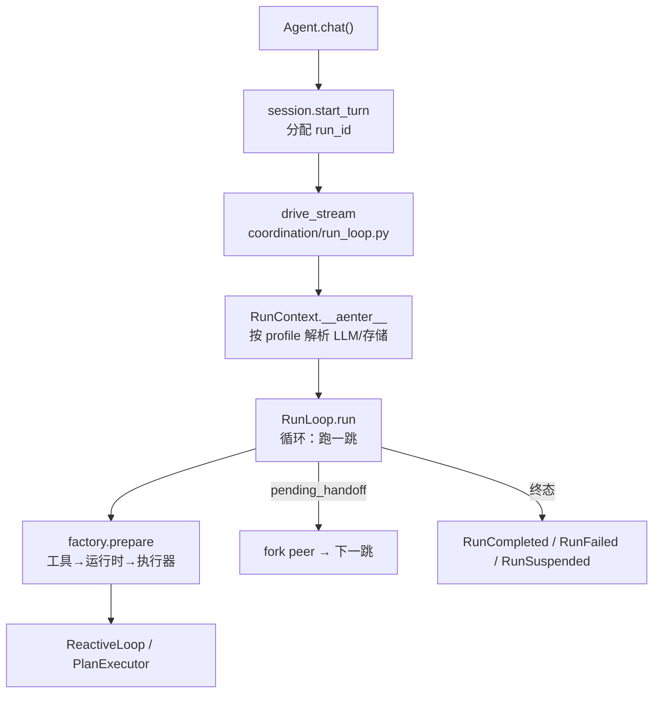

# ⑤ 循环 runtime

删掉所有可选代码后，框架的核心是一个 554 行的文件
（`runtime/agent.py`）加一个 425 行的循环（`runtime/reactive.py`）：

```python
# src/prodagent/runtime/reactive.py:178（节选，注释为文档所加）
async def _loop_events(self, run):
    while True:
        response, token_events = await self._think(run)      # ① 调模型
        done = await self._decide(run, response)             # ② 有工具调用吗？
        if done:
            yield RunCompletedEvent(run=run)
            return
        async for batch_evt in self._dispatcher.run_batch(   # ③ 执行工具
            run, response.tool_calls):
            yield batch_evt
        if run.state is RunState.SUSPENDED:                  # ④ 审批挂起
            yield RunSuspendedEvent(run=run)
            return
```

**think → decide → execute**，和任何 ReAct 循环同构。工业级实现和玩具
的差距在每个箭头上的纪律：

- **think 之前**：预算检查（超了就停）、死循环探测
  （`core/progress.py` 的指纹窗口——同样的调用反复出现即 `InfiniteLoopDetected`）。
- **think 的调用带超时**：`asyncio.wait_for` 的上限来自预算的
  `max_seconds` 减去已耗时——“时间预算”不是事后统计，是 LLM 调用的
  硬超时。
- **execute 之后**：预算再查一次（工具结果可能触发了 spawn，子花销
  要汇入）。
- **挂起是正常出口**：审批门拦下的 run 从 ③ 直接进入 SUSPENDED 并
  正常返回事件流——恢复时 `pending_tool_call` 重放，不重新问模型。

## Agent：两段式构造

`runtime/agent.py:65` 的 `Agent` 是唯一的装配入口。构造面刻意分两层：

```python
Agent("shopper",
      system_prompt=...,          # 热参数：几乎每个 agent 都设的五个
      tools=[...],
      mode=ExecutionMode.REACTIVE,
      budget=HardBudget(...),
      config=AgentConfig(...))    # 其余一切（llm/拓扑/存储/hooks/扩展）
```

`AgentConfig`（`runtime/config.py`）有 28 个字段但分四组语义：模型与
工具、协作拓扑（`agents=`/`peers=`）、生产存储（checkpoint/session/
event_log）、扩展（hooks/extensions/mcp）。**热参数会覆盖 config 的同名
字段**——两条路最终写进同一份 config，不存在第三种状态。

`chat()`（`runtime/agent.py:197`）做的事比看起来少：会话轮次簿记
（`ConversationSession.start_turn` 分配 `run_id`）、把流交给执行层、
在终态事件上落账。真正的执行入口在下一层。

## 一跳的解剖：run_loop 与 factory

`Agent.chat()` 调 `coordination/run_loop.py:114` 的 `drive_stream`：
构造 `RunContext`（`run_loop.py:67`——裸核在此**按 profile** 解析 LLM、
存储与外溢仓库；bare 下 `checkpoint` 保持 `None`），然后交给
`RunLoop`（`run_loop.py:211`）。RunLoop 只做一件事：**跑一跳，看结果
要不要交给下一个 peer**——没有 peers 时它就是单跳容器。

每一跳经 `runtime/factory.py:45` 的 `prepare()` 装配，自上而下三步：
工具集（inline + registry + MCP + spawn/peer 包装）→ 运行时
（dispatcher、可选的上下文管理器、预算、系统提示）→ 执行器
（PLAN_FIRST 还是 REACTIVE）。这里曾经是三层私有方法的接力，现在是一个能从头读到尾的函数。



## 取舍

**不把循环做成可组合的“步骤图”（用户编排 think/tool/reflect）？**
因为循环的正确性恰恰来自**不可编排**：预算检查在 think 前后、挂起在
execute 后、恢复在 think 前——这些次序是事故换来的不变量，开放编排
等于把不变量交给每个用户重新实现一遍。框架把可变性留给两处真正需要
它的地方：执行器（PLAN_FIRST/REACTIVE）和 hooks（专题各章）。

**chat() 默认不走 PLAN_FIRST。** 曾经默认走最重的路径
（planner + DAG + 事件日志）意味着 hello-world 也要付规划税。现在
PLAN_FIRST 是显式选择——而它值得显式选择，这是下一站的故事。

