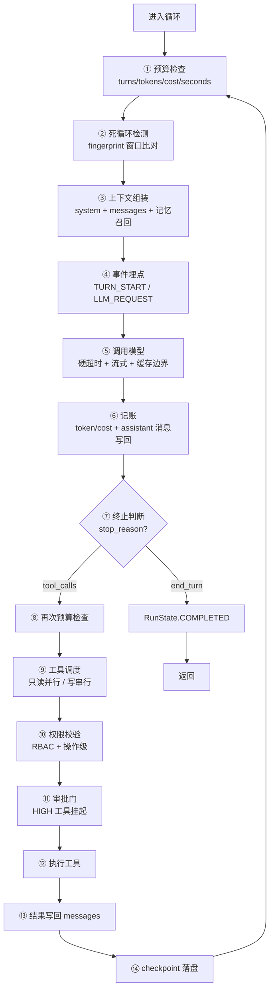
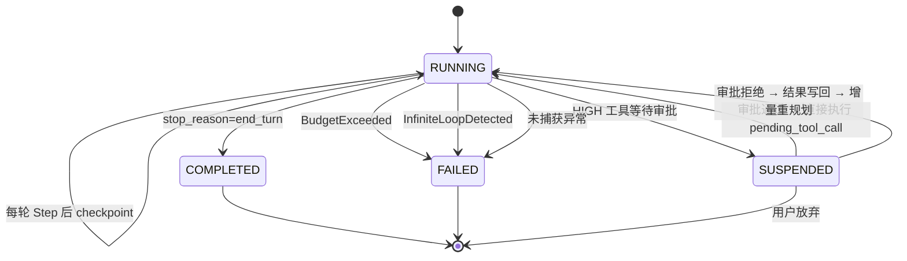

# 第 ⑤ 站：循环内核

> 这是整个框架的心脏。一个 `while True` 调模型的循环，上生产之前要加多少层护甲？这一站给你完整答案。

---

## 先看裸循环

所有 Agent 框架的本质都是这个：

```python
while True:
    response = llm.complete(messages)
    if response.stop_reason == "end_turn":
        return response.content
    for tool_call in response.tool_calls:
        result = execute(tool_call)
        messages.append({"role": "tool", "content": result})
```

5 行代码。但这 5 行上生产之前，要加的东西比你想象的多得多。

---

## prodagent 的循环加了多少层？



**14 层护甲。** 每一层都对应一个真实的生产事故。下面逐层拆解。

---

## ① 预算检查：四轴同时生效

```python
def _check_budget(self, run: AgentRun) -> None:
    check_spawn_budget(run, self._budget, self._budget_ledger)
```

在 Step 的**开头**和**工具执行后**各检查一次。

四轴：
- **turns** — 最多多少轮（防死循环）
- **seconds** — 最多跑多久（防卡死）
- **tokens** — 最多消耗多少 token（防烧钱）
- **cost** — 最多花多少钱（防超预算）

任一触顶即抛 `BudgetExceeded`，循环终止。

> 为什么检查两次？开头检查是"这一轮还能不能开始"，工具执行后检查是"这一轮做完后还超不超"。模型调用本身可能消耗大量 token，只在开头查是不够的。

详细机制见 [预算专题](../topics/budget.md)。

---

## ② 死循环检测：fingerprint 窗口

```python
self._progress = ProgressMonitor(
    stall_threshold=cfg.stall_threshold,
    repeat_threshold=cfg.repeat_threshold,
    window_size=cfg.fingerprint_window,
)
```

**原理**：记录最近 N 轮的"指纹"（工具名 + 参数哈希 + 输出摘要），如果发现：
- **重复模式** — 连续 K 轮调用相同工具、相同参数 → `InfiniteLoopDetected`
- **停滞模式** — 连续 N 轮没有新信息产出 → 触发警告或终止

这比单纯的"max_turns"更智能：max_turns=20 可能在第 5 轮就进入死循环但还要白跑 15 轮。fingerprint 检测能在第 7-8 轮就发现。

---

## ③ 上下文组装：不是简单的 messages 列表

```python
async def _assemble(run: AgentRun) -> tuple[str, MessageList]:
    return await cm.prepare(
        run,
        hooks=self._hooks,
        invoked_skills=self._dispatcher.invoked_skills(),
    )
```

ContextManager 做的事情：
1. **记忆召回** — 根据当前任务从四通道记忆（规则/实体/精确/语义）中召回相关内容
2. **上下文压缩** — 如果 token 超阈值，按五级策略压缩历史消息
3. **技能注入** — 把已调用技能的 runbook 注入 system prompt
4. **spill 处理** — 超长工具结果溢出到外部存储，只保留摘要

组装后返回 `(system_prompt, messages)`，传给模型。

> 关键点：模型看到的不是原始 messages，而是经过"召回 + 压缩 + 注入"处理后的视图。这是 Agent 能处理长任务的核心。

---

## ⑤ 调用模型：硬超时不是事后检查

```python
llm_timeout = max(0.1, self._budget.max_seconds - run.elapsed_seconds())
coro = self._llm.complete(messages, system=system, tools=tools, config=llm_config, on_chunk=_on_chunk)
try:
    response = await asyncio.wait_for(coro, timeout=llm_timeout)
except TimeoutError as exc:
    raise BudgetExceeded(
        f"LLM call timed out after {llm_timeout:.1f}s.",
        axis="seconds",
        value=run.elapsed_seconds(),
        limit=self._budget.max_seconds,
    ) from exc
```

**时间预算是硬截止**：用 `asyncio.wait_for` 给模型调用设超时，超时时间 = 总预算 - 已用时间。不是"调用完了再看超没超"，而是"到点直接掐断"。

**流式回调**：`on_chunk` 每收到一个 token 就触发，用于：
- 实时输出到前端（打字机效果）
- 记录思维链（CoT）到 span
- 触发 THINK 事件

**缓存边界**：`cache_boundary_index` 告诉模型哪些消息可以做 prompt caching（Anthropic 的 cache_control），哪些不能。

---

## ⑥ 记账：缓存感知的成本计算

```python
async def _account(self, run: AgentRun, response: LLMResponse) -> None:
    run.metrics.turn_count += 1
    if not getattr(response, "from_cache", False):
        run.add_tokens(
            response,
            cost_usd=self._llm_config.cost_for_response(response) if self._llm_config else 0.0,
        )
```

`cost_for_response` 的计算：
```python
def token_cost_usd(response, pricing):
    cache_read = response.cache_read_tokens or 0
    cache_write = response.cache_write_tokens or 0
    input_billed = max(0, response.input_tokens - cache_read - cache_write)
    return (
        input_billed / 1e6 * pricing.input_rate
        + response.output_tokens / 1e6 * pricing.output_rate
        + cache_read / 1e6 * pricing.input_rate * pricing.cache_read_discount   # 0.1x
        + cache_write / 1e6 * pricing.input_rate * pricing.cache_write_premium  # 1.25x
    )
```

**为什么 cache_read 不计入 token 预算？** 因为 cache_read 几乎不花钱（Anthropic 是 0.1x），如果计入预算会导致"明明很便宜但预算先耗尽"的反直觉行为。预算的 token 轴用的是 `billable_tokens = total - cache_read`。

---

## ⑩ 权限校验：三层策略

工具执行前，经过权限策略引擎：

```
请求 → ① Agent 身份校验 → ② 工具权限校验 → ③ 数据访问校验 → 执行
```

- **Agent 身份** — 这个 Agent 角色能不能调用这类工具？
- **工具权限** — 这个具体工具在当前上下文中是否被允许？
- **数据访问** — 工具参数里的资源（文件路径、数据库 ID）是否在授权范围内？

越权操作不抛异常打断循环，而是返回结构化的 `ToolError`，让模型知道"这个操作被拒绝了，换个方式"。

---

## ⑪ 审批门：HIGH 工具挂起

```python
if tool.meta.side_effect == SideEffectLevel.HIGH:
    run.pending_tool_call = tool_call
    run.state = RunState.SUSPENDED
    yield RunSuspendedEvent(run=run)
    return  # 退出循环，等待外部审批
```

**关键设计**：
- 挂起时把 `tool_call` 存到 `run.pending_tool_call`
- 审批通过后，恢复时**直接执行这个 tool_call**，不重新问 LLM
- 审批拒绝后，把拒绝原因作为 tool result 写回，让模型**增量重规划**（不是从头开始）

这避免了"审批等了 10 分钟，通过后模型已经忘了之前在做什么"的问题。

---

## ⑭ checkpoint：每轮落盘

```python
finally:
    if self._checkpoint_store is not None:
        await save_and_fire_checkpoint(self._checkpoint_store, run, self._hooks)
```

每一轮 Step 结束后（无论成功、失败、挂起），都保存 checkpoint。用 `expected_version` 做乐观并发控制。

**恢复时**：
```python
if self._checkpoint_store is not None and run_id:
    existing = await self._checkpoint_store.load(run_id)
    if existing is not None:
        existing.state = RunState.RUNNING
        return existing  # 从断点继续
```

---

## 循环的状态转换



---

## ReactiveLoop vs Step 的分工

很多框架把循环逻辑写在一个大函数里。prodagent 拆成了两个类：

| | ReactiveLoop | Step |
|---|---|---|
| **职责** | 循环策略（什么时候停、怎么恢复、怎么结算） | 一轮的原子执行（想→做→记账） |
| **状态** | 管理 Run 的生命周期 | 无状态，每次 run() 处理一个 Run |
| **可替换** | 换执行模式（PLAN_FIRST）时替换 | 所有模式共用同一个 Step |
| **代码量** | ~200 行 | ~200 行 |

> 这个拆分很关键。PLAN_FIRST 模式的循环逻辑完全不同（要管理 DAG 依赖、并行执行、断点续跑），但每一步的"想→做→记账"是一样的。把 Step 抽出来，两种模式共享同一段经过充分测试的原子代码。

---

## 代码定位

| 内容 | 源码位置 |
|------|---------|
| ReactiveLoop | `kernel/loop.py` |
| Step | `kernel/step.py` |
| 预算 | `kernel/budget.py` |
| 事件总线 | `kernel/bus.py` |
| 状态定义 | `kernel/state.py` `kernel/types.py` |
| 进度监控（死循环检测） | `kernel/progress.py` |

---

## 下一步

👉 **[第 ⑥ 站：规划与 DAG →](06-plan.md)** — 三种执行模式怎么选？动态 DAG 怎么做断点续跑？

或者深入 [预算专题 →](../topics/budget.md)，看四轴预算和 BudgetLedger 的完整设计。
