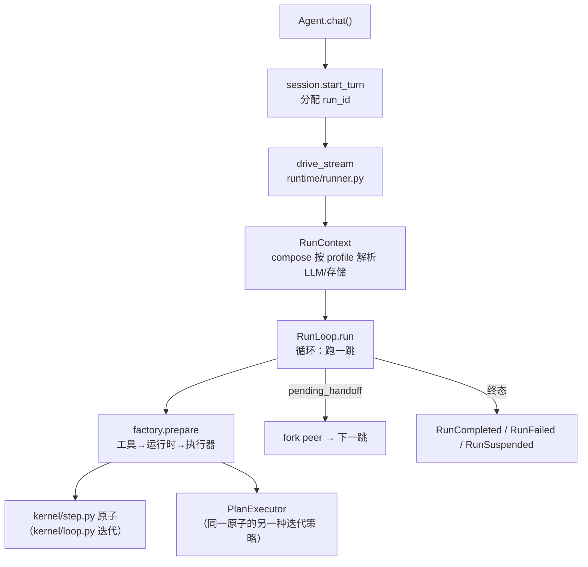

# ⑤ 循环 kernel + runtime

框架的最内核是一个独立成篇的包 `kernel/`——七个模块、约 2100 行、
不 import 任何能力包（有 CI 测试钉死这一点）。按阅读顺序：

| 模块 | 内容 |
|---|---|
| `kernel/types.py` | 五个名词：Message / ToolCall / ToolResult / LLMResponse / RunState |
| `kernel/events.py` | 流出去的事件 |
| `kernel/state.py` | AgentRun——一次执行的全部可变状态 |
| `kernel/bus.py` | 三协议总线：fire（观察）/ check（卡位）/ collect（注入） |
| `kernel/budget.py` | HardBudget 上限 + 共享 BudgetLedger 账本 |
| `kernel/step.py` | **原子**：一次模型调用 + 至多一轮工具执行 |
| `kernel/loop.py` | REACTIVE 循环：迭代原子的策略 |

循环本体（`kernel/loop.py`）现在只剩终止翻译：

```python
# src/prodagent/kernel/loop.py（节选，注释为文档所加）
while True:
    async for event in self._step.run(run, ...):   # 原子：think → act
        yield event
    if run.pending_handoff is not None:            # 移交给 peer
        yield RunCompletedEvent(run=run); return
    if run.state is RunState.COMPLETED:            # 模型不再要工具
        yield RunCompletedEvent(run=run); return
    if run.state is RunState.SUSPENDED:            # 审批挂起
        yield RunSuspendedEvent(run=run); return
```

原子里才是真正的 **think → decide → execute**（`kernel/step.py`）——
装配上下文 → 调模型（超时 = 时间预算的剩余量）→ 记账 → 判定
END_TURN → 执行工具批。工业级实现和玩具的差距在每个箭头上的纪律：

**think → decide → execute**，和任何 ReAct 循环同构。工业级实现和玩具
的差距在每个箭头上的纪律：

- **think 之前**：预算检查（超了就停）、死循环探测
  （`core/progress.py` 的指纹窗口——同样的调用反复出现即 `InfiniteLoopDetected`）。
- **think 的调用带超时**：`asyncio.wait_for` 的上限来自预算的
  `max_seconds` 减去已耗时——“时间预算”不是事后统计，是 LLM 调用的
  硬超时。
- **execute 之后**：预算再查一次（工具结果可能触发了 spawn，子花销
  要汇入）。
- **挂起是正常出口**：审批门拦下的 run 从 ③ 直接进入 SUSPENDED 并
  正常返回事件流——恢复时 `pending_tool_call` 重放，不重新问模型。

## Agent：两段式构造

`runtime/agent.py:65` 的 `Agent` 是唯一的装配入口。构造面刻意分两层：

```python
Agent("shopper",
      system_prompt=...,          # 热参数：几乎每个 agent 都设的五个
      tools=[...],
      mode=ExecutionMode.REACTIVE,
      budget=HardBudget(...),
      config=AgentConfig(...))    # 其余一切（llm/拓扑/存储/hooks/扩展）
```

`AgentConfig`（`runtime/config.py`）有 28 个字段但分四组语义：模型与
工具、协作拓扑（`agents=`/`peers=`）、生产存储（checkpoint/session/
event_log）、扩展（hooks/extensions/mcp）。**热参数会覆盖 config 的同名
字段**——两条路最终写进同一份 config，不存在第三种状态。

`chat()`（`runtime/agent.py:197`）做的事比看起来少：会话轮次簿记
（`ConversationSession.start_turn` 分配 `run_id`）、把流交给执行层、
在终态事件上落账。真正的执行入口在下一层。

## 一跳的解剖：runner 与 factory

`Agent.chat()` 调 `runtime/runner.py` 的 `drive_stream`：构造
`RunContext`（裸核在此**按 profile** 解析 LLM、存储与外溢仓库——
profile 的所有分支都住在 `runtime/compose.py` 一个文件里；bare 下
`checkpoint` 保持 `None`），然后交给 `RunLoop`。RunLoop 只做一件事：
**跑一跳，看结果要不要交给下一个 peer**——没有 peers 时它就是单跳容器。

每一跳经 `runtime/factory.py` 的 `prepare()` 装配，自上而下三步：
工具集（inline + registry + MCP + 经 compose 接缝挂上的 spawn/peer
包装——factory 不认识任何协作能力）→ 运行时（dispatcher、可选的
上下文管理器、预算、系统提示）→ 执行器（PLAN_FIRST 还是 REACTIVE）。



## 取舍

**不把循环做成可组合的“步骤图”（用户编排 think/tool/reflect）？**
因为循环的正确性恰恰来自**不可编排**：预算检查在 think 前后、挂起在
execute 后、恢复在 think 前——这些次序是事故换来的不变量，开放编排
等于把不变量交给每个用户重新实现一遍。框架把可变性留给两处真正需要
它的地方：执行器（PLAN_FIRST/REACTIVE）和 hooks（专题各章）。

**chat() 默认不走 PLAN_FIRST。** 曾经默认走最重的路径
（planner + DAG + 事件日志）意味着 hello-world 也要付规划税。现在
PLAN_FIRST 是显式选择——而它值得显式选择，这是下一站的故事。

