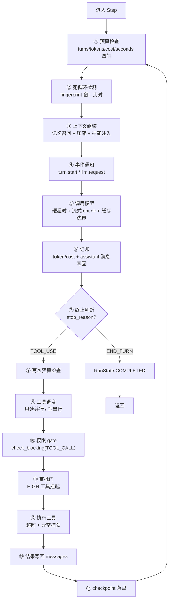
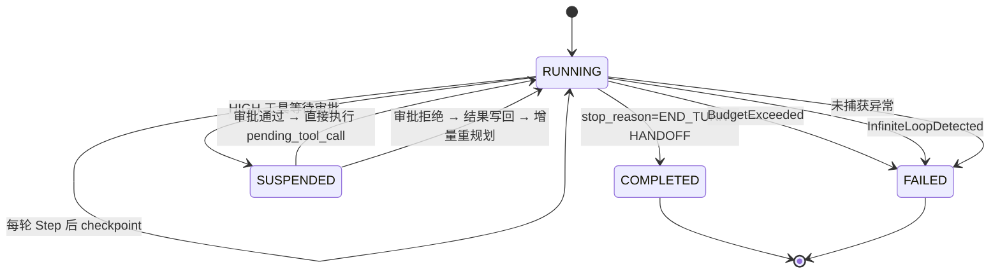

# 第 ⑤ 站：循环内核

> 这是整个框架的心脏。一个 `while True` 调模型的循环，上生产之前要加多少层护甲？这一站给你完整答案。

---

## 先看裸循环

所有 Agent 框架的本质都是这个：

```python
while True:
    response = llm.complete(messages)
    if response.stop_reason == StopReason.END_TURN:
        return response.content
    for tool_call in response.tool_calls:
        result = execute(tool_call)
        messages.append({"role": "tool", "content": result})
```

5 行代码。但这 5 行上生产之前，要加的东西比你想象的多得多。

---

## prodagent 的一个 Step 经历了什么



这不是文档作者编的数字——每一步都对应 `kernel/step.py` 和 `kernel/loop.py` 中的真实代码路径。下面逐层拆解。

---

## ① 预算检查：四轴同时生效

```python
def _check_budget(self, run: AgentRun) -> None:
    check_budget(run, self._budget, self._budget_ledger)
```

在 Step 的**开头**和**工具执行后**各检查一次。

四轴：
- **turns** — 最多多少轮（防死循环）
- **seconds** — 最多跑多久（防卡死）
- **tokens** — 最多消耗多少 billable token（防烧 token）
- **cost** — 最多花多少钱（防超预算）

任一触顶即抛 `BudgetExceeded`，循环终止。

> 为什么检查两次？开头检查是"这一轮还能不能开始"，工具执行后检查是"这一轮做完后还超不超"。模型调用本身可能消耗大量 token，只在开头查是不够的。

详细机制见 [预算专题](../topics/budget.md)。

---

## ② 死循环检测：fingerprint 窗口

```python
self._progress = ProgressMonitor(
    stall_threshold=cfg.stall_threshold,
    repeat_threshold=cfg.repeat_threshold,
    window_size=cfg.fingerprint_window,
)
```

**原理**：记录最近 N 轮的"指纹"（工具名 + 参数哈希），如果发现：
- **重复模式** — 连续 K 轮调用相同工具、相同参数 → `InfiniteLoopDetected`
- **停滞模式** — 连续 N 轮上下文哈希不变（Ghost loop）→ `InfiniteLoopDetected`

一个细节：指纹计算会**剔除 `limit` 参数**——同一个查询只变分页大小的"退化翻页"也算同一个调用，这正是一种典型的死循环形态。

这比单纯的"max_turns"更智能：max_turns=20 可能在第 5 轮就进入死循环但还要白跑 15 轮。fingerprint 检测能提前发现。

指纹存在 `AgentRun.fingerprints` 上，随 checkpoint 持久化——恢复后死循环检测的历史不丢。

---

## ③ 上下文组装：不是简单的 messages 列表

```python
async def _assemble(run: AgentRun) -> tuple[str, MessageList]:
    return await cm.prepare(
        run,
        hooks=self._hooks,
        invoked_skills=self._dispatcher.invoked_skills(),
    )
```

ContextManager 做的事情：
1. **记忆召回** — 通过 `collect(INJECTION_POINT)` 从注册的 injector 获取记忆内容
2. **上下文压缩** — 如果 token 超阈值，按五级策略压缩历史消息
3. **技能注入** — 把已加载技能的 runbook 注入 system prompt
4. **spill 处理** — 超长工具结果溢出到外部存储，只保留摘要

组装后返回 `(system_prompt, messages)`，传给模型。

> 关键点：模型看到的不是原始 messages，而是经过"召回 + 压缩 + 注入"处理后的视图。原始消息完整保存在 Run 里，checkpoint 落盘的是完整历史。

**消息排序也有设计**：注入块（记忆 / 技能 / 状态 / 约束提醒）排在对话历史**之后**，而不是之前。两个原因：

1. **缓存前缀稳定**——注入块每轮都在变（记忆召回不同、状态在走），历史前缀则基本不动。把会变的块放在前面，等于每轮都把 prompt cache 打碎重来；放在后面，缓存边界（`cache_boundary_index`）之前的字节逐轮稳定，缓存命中率才能起来。
2. **指令就近**——约束提醒这类"必须遵守"的内容放在离回答最近的位置，模型对尾部指令的遵守度更高，这是免费的收益。

一个排序决定，同时买到成本（缓存）和质量（指令遵从），这就是上下文组装不只是"拼列表"的原因。

---

## ⑤ 调用模型：硬超时不是事后检查

```python
llm_timeout = max(0.1, self._budget.max_seconds - run.elapsed_seconds())
coro = self._llm.complete(messages, system=system, tools=tools,
                          config=llm_config, on_chunk=_on_chunk)
try:
    response = await asyncio.wait_for(coro, timeout=llm_timeout)
except TimeoutError as exc:
    raise BudgetExceeded(
        f"LLM call timed out after {llm_timeout:.1f}s.",
        axis="seconds",
        value=run.elapsed_seconds(),
        limit=self._budget.max_seconds,
    ) from exc
```

**时间预算是硬截止**：用 `asyncio.wait_for` 给模型调用设超时，超时时间 = 总预算 - 已用时间。不是"调用完了再看超没超"，而是"到点直接掐断"。

**流式回调**：`on_chunk` 每收到一个 token 就触发，用于：
- 实时输出到前端（打字机效果）
- 记录思维链（reasoning_content）
- 触发 `llm.think` 事件

**缓存边界**：`cache_boundary_index` 告诉模型哪些消息可以做 prompt caching（Anthropic 的 cache_control），哪些不能。

---

## ⑥ 记账：缓存感知的成本计算

```python
async def _account(self, run: AgentRun, response: LLMResponse) -> None:
    run.metrics.turn_count += 1
    if not getattr(response, "from_cache", False):
        run.add_tokens(
            response,
            cost_usd=self._llm_config.cost_for_response(response) if self._llm_config else 0.0,
        )
```

`cost_for_response` 的计算区分四类 token：
- 普通输入：全价
- 输出：全价（通常比输入贵）
- cache_read：折扣价（Anthropic 0.1x，OpenAI 0.5x）
- cache_write：溢价（Anthropic 1.25x）

**为什么 cache_read 不计入 token 预算？** 因为 cache_read 几乎不花钱，如果计入预算会导致"明明很便宜但预算先耗尽"的反直觉行为。预算的 token 轴用的是 `billable_tokens = total - cache_read`。

---

## ⑩ 权限 gate：check_blocking

工具执行前，通过三协议总线的 VETO 通道执行权限检查：

```python
veto = await self._hooks.check_blocking(
    Gate.TOOL_CALL,
    call=call,
    tool=tool,
    run=run,
)
if veto.blocked:
    return ToolResult.blocked_by(veto.reason, tool=call.name)
```

任何注册到 `Gate.TOOL_CALL` 的 checker 都可以拦截工具调用。checker 返回 `BlockingResult(blocked=True, reason="...")` 即可。

**fail-closed**：如果 checker 抛异常，默认策略是 fail-closed（拦截），而不是 fail-open（放行）。这是安全优先的设计。

---

## ⑪ 审批门：HIGH 工具挂起

```python
if tool.meta.side_effect_level == SideEffectLevel.HIGH:
    run.pending_tool_call = tool_call
    run.state = RunState.SUSPENDED
    yield RunSuspendedEvent(run=run)
    return  # 退出循环，等待外部审批
```

**关键设计**：
- 挂起时把 `tool_call` 存到 `run.pending_tool_call`
- 审批通过后，恢复时**直接执行这个 tool_call**，不重新问 LLM
- 审批拒绝后，把拒绝原因作为 tool result 写回，让模型**增量重规划**（不是从头开始）

这避免了"审批等了 10 分钟，通过后模型已经忘了之前在做什么"的问题。详见 [HITL 审批专题 →](../topics/approval.md)。

---

## ⑭ checkpoint：每轮落盘

```python
finally:
    if self._checkpoint_store is not None:
        await save_and_fire_checkpoint(self._checkpoint_store, run, self._hooks)
```

每一轮 Step 结束后（无论成功、失败、挂起），都在 `finally` 块中保存 checkpoint。用 `expected_version` 做乐观并发控制。

**恢复时**：
```python
if self._checkpoint_store is not None and run_id:
    existing = await self._checkpoint_store.load(run_id)
    if existing is not None:
        # SUSPENDED 状态 → 直接执行 pending_tool_call
        # 其他状态 → prune 未完成的 tool call，重新 RUNNING
        return existing
```

详见 [崩溃恢复专题 →](../topics/recovery.md)。

---

## 循环的状态转换



---

## ReactiveLoop vs Step 的分工

很多框架把循环逻辑写在一个大函数里。prodagent 拆成了两个类：

| | ReactiveLoop | Step |
|---|---|---|
| **职责** | 循环策略（什么时候停、怎么恢复、怎么结算） | 一轮的原子执行（想→做→记账） |
| **状态** | 管理 Run 的生命周期 | 无状态，每次 run() 处理一个 Run |
| **可替换** | 换执行模式（PLAN_FIRST）时替换 | 所有模式共用同一个 Step |

> 这个拆分很关键。PLAN_FIRST 模式的循环逻辑完全不同（要管理 DAG 依赖、并行执行、断点续跑），但每一步的"想→做→记账"是一样的。把 Step 抽出来，两种模式共享同一段经过充分测试的原子代码。

---

## 代码定位

| 内容 | 源码位置 |
|------|---------|
| ReactiveLoop | `kernel/loop.py` |
| Step | `kernel/step.py` |
| HardBudget / BudgetLedger | `kernel/budget.py` |
| 三协议总线 HookRegistry | `kernel/bus.py` |
| AgentRun 状态 | `kernel/state.py` |
| 类型定义 | `kernel/types.py` |
| ProgressMonitor（死循环检测） | `kernel/progress.py` |

---

## 下一步

👉 **[第 ⑥ 站：规划与 DAG →](06-plan.md)** — PLAN_FIRST 模式怎么工作？动态 DAG 怎么做断点续跑？Workflow 怎么手写确定性计划？

或者深入 [预算专题 →](../topics/budget.md)，看四轴预算和 BudgetLedger 的完整设计。
