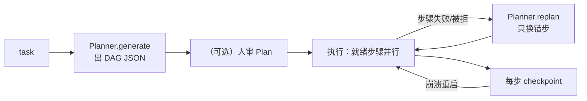

# ⑥ 规划 plan

REACTIVE 循环每步都问模型“接下来干嘛”。任务有结构时这样既浪费又危险：
重复决策是浪费，第十步忘了第二步的约束是危险。

`plan/` 是另一种答案：**先把路线画成 DAG，审它，再执行它**。

```python
# src/prodagent/plan/dag.py:15（节选）
@dataclass
class PlanStep:
    id: str
    action: str            # 工具名
    params: dict[str, Any]
    depends_on: list[str]
    terminal: bool
```

一个 `Plan` 就是一组这样的步骤。没有更多结构——没有嵌套、没有循环、
没有条件分支。**故意的**：DAG 越弱，可审计性越强。人能一眼看完的
计划才审得动；需要循环/分支的逻辑放在工具里或放在 REACTIVE 子 Agent 里。

## 三种拿到 Plan 的方式

| 方式 | 谁写计划 | 入口 | 典型场景 |
|---|---|---|---|
| 动态规划 | LLM | `mode=ExecutionMode.PLAN_FIRST` → `Planner.generate()`（`plan/planner.py:73`，提示词在 `plan/prompts/planning.txt`） | 结构未知，交给模型推理 |
| 静态编排 | 人 | `Workflow`（`plan/workflow.py:39`）+ `wf.step(peer)` / `wf.llm_step(...)` | 路线已知且要可 review |
| 混合 | 人定骨架 | `workflow=` 自动切 PLAN_FIRST 并可 `allow_replan=False` 钉死 | 骨架固定、参数动态 |

`Workflow` 的 DSL 很小——两种节点（委派给子 Agent 的 `step`、真调模型的
`llm_step`）加 `depends_on`。`wf.compile()` 把它变成预设 Plan，等价于
模型自己画出来的那种。旅行规划示例（trip_planner）就是七个节点的
静态 DAG：解析偏好 → 三个 peer 并行（行程/餐厅/交通）→ 合并预算 →
天气调整 → 终稿。

## 执行：PlanExecutor 的三个承诺

`PlanExecutor`（`plan/executor.py:64`）执行 DAG 时承诺：

1. **就绪即并行**——无依赖关系的步骤并发跑（和工具层的只读并行呼应，
   但这里是步骤级：s2、s3 同时开）。
2. **断点续跑**——每步落 checkpoint 与计划事件（`plan/event_log.py`）。
   崩溃重启后，已完成的步骤**不重跑**，从断点继续。前提是
   production 形态（bare 没有 checkpoint 可落）——
   [崩溃恢复](../topics/recovery.md)一章展开。
3. **增量重规划**——某步失败或被人拒绝时，`Planner.replan()`
   （提示词 `plan/prompts/replan.txt`）只生成**替换步骤**：输入是
   已完成步骤的输出 + 失败原因，输出标注 `replaces: "s4"`。
   已完成的分析不浪费，换的只是走错的那一步。



合规审计示例（compliance_audit）演示完整闭环：动态生成“抽取→标注‖关联→
提交”的 DAG，HIGH 的提交步骤被人**拒绝**，触发增量重规划——模型不再
重试会被拒的提交，改调只读的“草拟报告留人复核”，复用前三步的全部
结果。

## 取舍

**不是图灵完备的计划（循环/条件）？** 因为计划的读者不是
机器是人。审批的人要在执行前看懂整条路线；带循环的计划需要模拟才能
回答“它最终会做什么”，可审计性归零。需要迭代？把迭代包进一个工具，
计划里它仍是一步。

**为什么 Workflow 是代码不是 YAML/JSON 配置？** 计划里的节点引用的是
**Agent 对象和函数**，不是字符串名字——类型检查器在你写 `wf.step(peer)`
时就知道 peer 是什么。配置文件表达引用要发明一套名字解析协议，
换回的是没有类型、没有跳转、没有重构支持的一段字符串。

