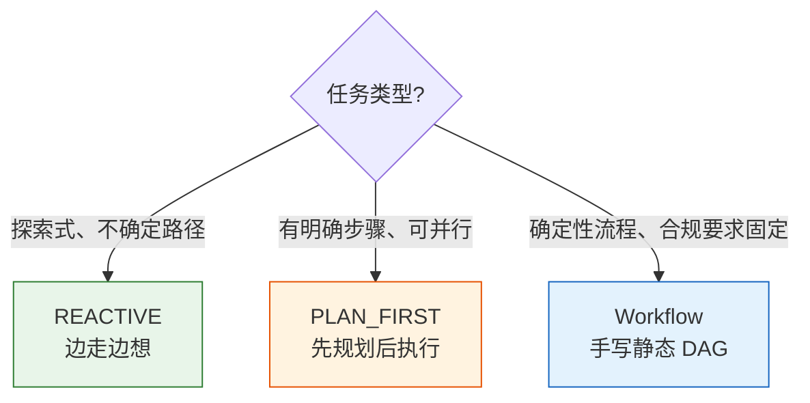
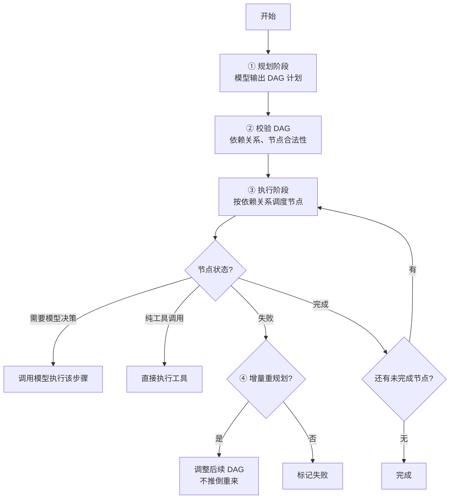
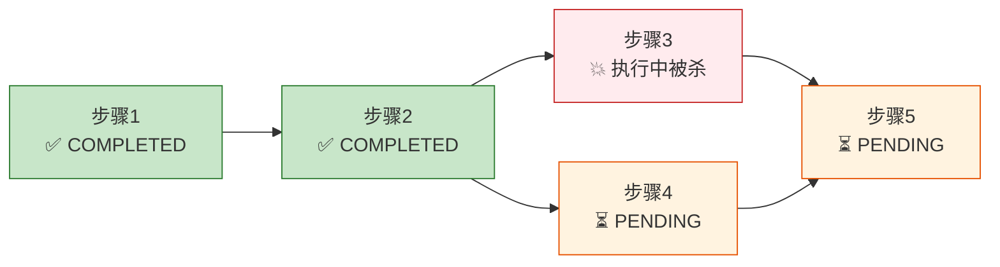
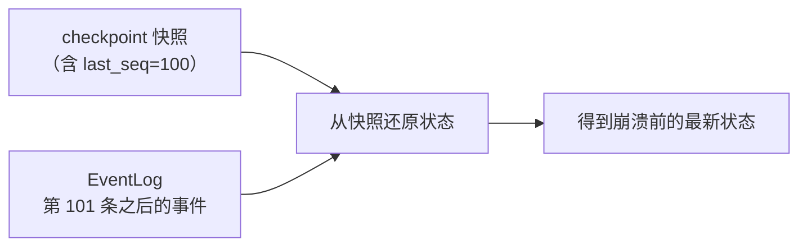
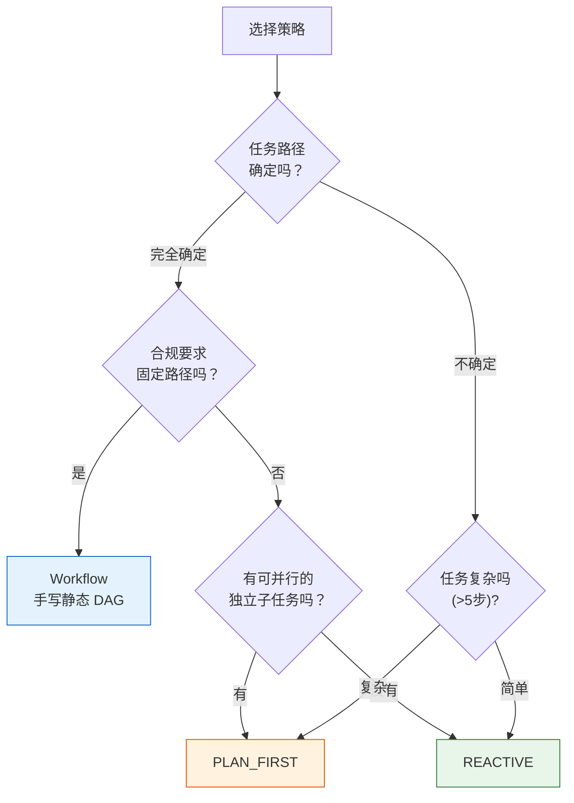

# 第 ⑥ 站：规划与 DAG

> 不是所有任务都适合"边走边想"。这一站讲清楚两种执行模式怎么选、PLAN_FIRST 的动态 DAG 怎么做断点续跑、Workflow 怎么手写确定性计划。

---

## 问题：一种循环走天下吗？



REACTIVE 模式很灵活，但不是万能的：
- 任务有 5 个独立子任务可以并行，REACTIVE 只能串行做
- 合规审计要求按固定步骤执行，REACTIVE 可能跳过或乱序
- 长任务跑到一半中断，REACTIVE 恢复后可能重复执行已完成的步骤

prodagent 提供两种执行模式 + 一个 Workflow 构建器，按任务复杂度选择。

---

## 两种执行模式 + Workflow

| 维度 | REACTIVE | PLAN_FIRST | Workflow |
|------|----------|------------|----------|
| 规划方式 | 无，边走边想 | 模型先输出 DAG | 代码手写 DAG |
| 模型参与 | 每轮都参与 | 规划时参与，执行时可选 | 仅 llm_step 中调用 |
| 并行能力 | 单轮内只读工具并行 | DAG 节点可并行 | DAG 节点可并行 |
| 断点续跑 | checkpoint 恢复整轮 | 按节点状态恢复 | 按节点状态恢复 |
| 确定性 | 低（每轮模型决策） | 中（计划固定，执行可调） | 高（完全固定） |
| 适合场景 | 探索、研究、调试 | 复杂任务、多步骤 | 合规、流水线 |
| 类比 | 开车去陌生地方 | 装修先出施工图 | 工厂流水线 |

> **注意**：`ExecutionMode` 枚举只有 `REACTIVE` 和 `PLAN_FIRST` 两个值。Workflow 不是第三种执行模式，而是一个独立的计划构建器——你用代码手写 DAG，通过 `workflow=` 参数传给 Agent，Agent 在 PLAN_FIRST 模式下执行这个预编译的 Plan。

---

## REACTIVE：边走边想

```python
agent = Agent("demo", mode=ExecutionMode.REACTIVE)
```

**执行流程**：

```
while True:
    response = llm.complete(messages)
    if response.stop_reason == StopReason.END_TURN:
        return response.content
    execute_tools(response.tool_calls)
```

每一轮模型自己决定"下一步做什么"。没有预先计划，完全根据当前上下文决策。

**优点**：灵活，能应对意外情况，适合探索式任务
**缺点**：可能绕路、可能重复、长任务容易失控（靠预算兜底）

详细的循环机制见 [第 ⑤ 站：循环内核 →](05-loop.md)。

---

## PLAN_FIRST：先规划后执行

```python
agent = Agent("demo", mode=ExecutionMode.PLAN_FIRST)
```

### 执行流程



### ① 规划阶段

模型输出一个 JSON 格式的 DAG：

```json
{
  "steps": [
    {"id": "search", "action": "search", "params": {"query": "..."}, "depends_on": []},
    {"id": "analyze", "action": "analyze", "params": {}, "depends_on": ["search"]},
    {"id": "report", "action": "write_report", "params": {}, "depends_on": ["analyze"]}
  ]
}
```

每个步骤有：
- `id` — 唯一标识
- `action` — 执行什么（工具名或模型决策）
- `params` — 参数
- `depends_on` — 依赖哪些步骤

### ② 校验 DAG

- 检查是否有循环依赖（DAG 必须无环）
- 检查依赖的节点是否存在
- 检查 action 是否是已注册的工具
- 校验失败返回错误，让模型重新规划

### ③ 执行阶段

PlanExecutor 按依赖关系调度：
- 没有依赖的节点可以**并行**执行
- 有依赖的节点等前置节点完成后执行
- 每个节点执行后更新状态（PENDING → RUNNING → COMPLETED/FAILED）

### ④ 增量重规划

这是 PLAN_FIRST 最有价值的特性。当某个节点失败（比如审批被拒、工具报错），不是推倒整个计划重来，而是：
1. 标记该节点为 FAILED
2. 把失败原因告诉模型
3. 模型**只调整受影响的后续节点**，已完成的节点不动
4. 继续执行调整后的 DAG

```
原计划: A → B → C → D
执行中: A ✅ → B ❌(审批被拒)
重规划: A ✅ → B' → C' → D   (A不动，B/C/D调整)
```

**为什么不推倒重来？**
- 已完成的步骤可能有副作用（发了邮件、写了数据库），重复执行危险
- 浪费 token 和时间
- 增量重规划更高效、更安全

---

## Workflow：手写确定性 DAG

Workflow 是一个**计划构建器**，让你用代码（而不是让模型）定义 DAG：

```python
from prodagent.plan import Workflow

wf = Workflow()

# ① 普通函数步骤——用 @wf.step 装饰器注册
@wf.step
async def fetch_data() -> str:
    """获取数据"""
    return "raw data"

@wf.step(depends_on=["fetch_data"])
async def analyze(fetch_data: str) -> str:
    """分析数据——参数名与依赖名匹配时自动绑定 {{fetch_data.output}}"""
    return f"analyzed: {fetch_data}"

# ② LLM 步骤——调用模型处理
wf.llm_step(
    name="summarize",
    prompt="总结分析结果：{{analyze.output}}",
    depends_on=["analyze"],
    is_terminal=True,
)

# ③ 工具步骤——调用已注册的工具
wf.tool_step(
    name="save_report",
    tool_name="write_file",
    params={"path": "report.md", "content": "{{summarize.output}}"},
    depends_on=["summarize"],
)

# 编译为 Plan
plan = wf.compile()

# 绑定到 Agent——Agent 在 PLAN_FIRST 模式下执行这个预编译的 Plan
agent = Agent(
    "demo",
    tools=[...],
    workflow=wf,  # Agent 构造时自动 bind(llm, hooks) 并 compile
    config=AgentConfig(name="demo"),
)
```

### Workflow API

| 方法 | 作用 |
|------|------|
| `wf.step(fn, *, name, depends_on, is_terminal, params)` | 注册普通函数步骤（可作装饰器） |
| `wf.llm_step(name, prompt, *, system, depends_on, is_terminal, params, config, timeout_ms)` | 注册一个调用 LLM 的步骤 |
| `wf.tool_step(name, tool_name, *, params, depends_on, is_terminal)` | 注册一个调用已有工具的步骤 |
| `wf.compile() -> Plan` | 编译为可执行的 Plan |
| `wf.bind(llm, hooks)` | 绑定 LLM 客户端和事件总线（Agent 构造时自动调用） |
| `wf.tools` | 返回所有步骤生成的 FunctionTool 列表 |

**自动参数绑定**：`@wf.step` 装饰的函数，如果参数名与依赖名匹配，自动绑定为 `{{dep.output}}` 模板引用。

**Agent 步骤**：`wf.step` 也可以直接接收一个 Agent 实例作为子步骤，会生成 `spawn_agent` 动作。

### 与 PLAN_FIRST 的区别

- DAG 是代码预定义的，模型不参与规划
- 每个步骤是普通函数或 LLM 调用，不是模型自由决策
- 完全确定，适合合规要求固定路径的场景
- `llm_step` 中模型只负责处理该步骤的输入，不决定流程

**适合场景**：
- 合规审计（必须按法规规定的步骤执行）
- 数据流水线（ETL）
- 审批流程（固定的审批节点）

---

## DAG 的断点续跑

PLAN_FIRST 和 Workflow 都支持 DAG 级别的断点续跑。



恢复时：
1. 加载 DAG 状态（每个节点的 PENDING/RUNNING/COMPLETED/FAILED/OBSOLETE/SUSPENDED）
2. **COMPLETED 节点不重复执行**
3. RUNNING 节点重置为 PENDING（不知道执行到哪了，安全起见重做）
4. 按依赖关系继续执行

DAG 状态存在 AgentRun 里，和消息历史一起序列化到 checkpoint。Plan 的状态变更还会通过 EventLog 一条条追加写入。两者结合，就是 prodagent 的恢复方式——**快照打底 + 尾部事件重放**（`base/event_log.py::hybrid_restore`）：



> **小白加餐：什么是事件溯源（Event Sourcing）？** 与其只存"当前结果"，不如把"导致结果的每一次变化（事件）"按顺序记下来；当前状态 = 从空状态开始，依次把每个事件"折叠（fold/reduce）"进去得到。你可以把它想成银行流水：余额是结果，但流水（事件）才是事实，任何时候都能靠流水把余额重新算出来。负责折叠的函数叫 **reducer**，它是纯函数——`(当前状态, 一个事件) → 新状态`，同样的事件序列必然得到同样的结果，所以极其好测。

**为什么要"快照 + 重放"混合，而不是只选一种？**

- 只靠事件重放：跑了几千个事件后，每次恢复都要从头折叠一遍，越来越慢；
- 只靠快照：两次快照之间的变化会丢，也无法验证快照和事件是否一致。

prodagent 的折中是：checkpoint 里存一份快照**和它对应的事件序号 `last_seq`**；恢复时先拿快照打底，**只重放序号之后的那一小段尾部事件**。如果连可用快照都没有（比如第一次恢复），才退化为"从空状态全量重放"。这和数据库里"WAL + checkpoint"、Kafka 里"日志压缩"是同一种经典智慧——**用定期快照截断重放长度，用事件流保证不丢增量。**

---

## 开场与收场：bootstrap 与 finalize
一次 PLAN_FIRST 运行，真正的执行器（`PlanExecutor`）只负责"按 DAG 跑步骤"这一件事；而**跑之前的准备**和**跑完后的收尾**被刻意拆到两个地方，保证执行器足够纯粹：

| 阶段 | 文件 | 职责 |
|------|------|------|
| 开场 `PlanBootstrap` | `plan/bootstrap.py` | 解决"初始的 (run, plan) 从哪来"：是新建并调用 Planner 生成 DAG，还是从 checkpoint 恢复；生成后还要过一遍 HITL 审批门（计划也可以要求人批准） |
| 收场 `finalize` | `plan/finalize.py` | 一组**纯函数**：把终态翻译成对外的流事件（完成/失败/挂起），并从"终态步骤（terminal step）"的输出回填 `run.final_output` |

这里有两个和前面一脉相承的设计：

1. **开场把"新建 vs 恢复"收敛在一处。** 调用方不必关心这次是全新规划还是断点续跑，`prepare()` 内部判断；HITL 审批门也放在开场而不是散在执行循环里——因为"计划能不能开始执行"本就是开场该回答的问题。
2. **收场用纯函数。** `finalize_run` 不做 IO、不产生副作用，只根据 run/plan 的现状决定终态和最终输出。纯函数意味着给定输入输出唯一，可以脱离整个框架单独测，也不会因为"收尾时又触发了什么副作用"而产生诡异 bug。你会发现这和 reducer、和 kernel 的纯度追求是同一条审美的延续：**把有副作用的部分缩到最小，把可推理、可测试的纯逻辑留下来。**

---

## 模式选择决策树



**经验法则**：
- 不确定、探索性的 → REACTIVE
- 复杂、多步骤、可并行 → PLAN_FIRST
- 固定流程、合规要求 → Workflow（手写 DAG 传给 PLAN_FIRST）

---

## 模式间的共享内核

两种模式看起来不同，但底层共享同一个 `Step` 原子：

```
REACTIVE:   while True: Step.run()
PLAN_FIRST: for node in ready_nodes: Step.run()  (按 DAG 调度)
Workflow:   for node in ready_nodes: function/llm/tool  (编译为 Plan 后由 PLAN_FIRST 执行)
```

`Step` 的"想→做→记账"逻辑是共用的，经过了框架 1,300+ 个测试的验证。两种模式的差异只在"什么时候调用 Step"和"调用哪个 Step"。

> 这就是为什么把 kernel 从 runtime 拆出来——核心循环逻辑只写一次、测一次，两种模式共享。

---

## 代码定位

| 内容 | 源码位置 |
|------|---------|
| ExecutionMode 枚举 | `base/types.py` |
| ReactiveLoop | `kernel/loop.py` |
| Plan / PlanStep DAG 结构 | `plan/dag.py` |
| Planner（模型输出 DAG） | `plan/planner.py` |
| PlanExecutor（DAG 调度） | `plan/executor.py` |
| StepRunner（单步执行） | `plan/step_runner.py` |
| 开场（准备/恢复/计划审批门） | `plan/bootstrap.py` |
| 收场（终态/最终输出，纯函数） | `plan/finalize.py` |
| 快照+尾部重放的混合还原 | `base/event_log.py::hybrid_restore` |
| Workflow 构建器 | `plan/workflow.py` |
| Plan 事件溯源 | `plan/event_log.py` |
| Agent 装配与模式选择 | `runtime/agent.py` `runtime/factory.py` |

---

## 下一步

👉 **[第 ⑦ 站：多 Agent 协作 →](07-multiagent.md)** — 五种协作原语怎么选？统一消息平面怎么工作？

或者深入 [HITL 审批专题 →](../topics/approval.md)，看审批拒绝如何触发增量重规划。
