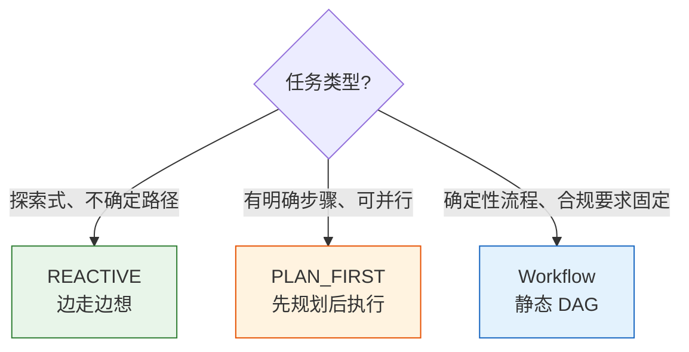
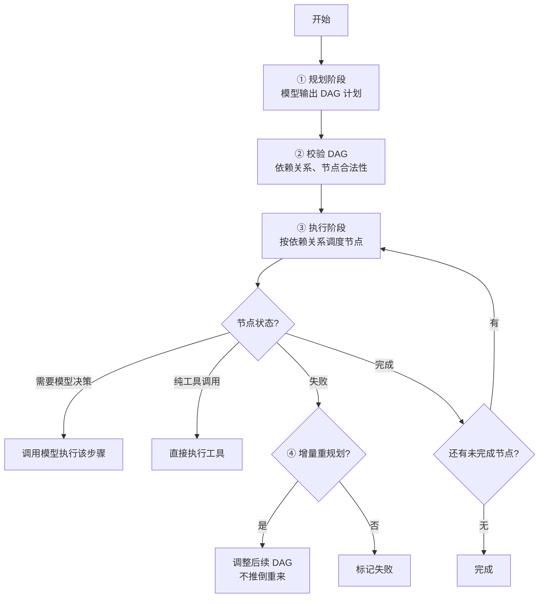
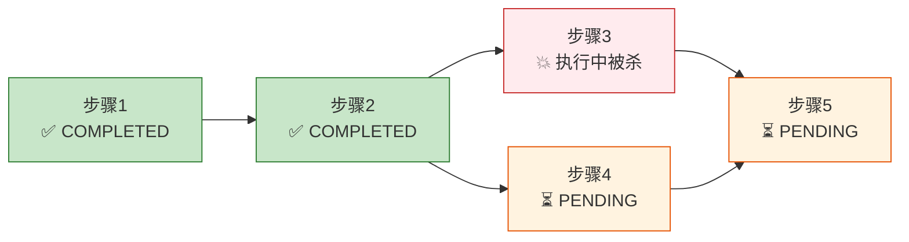
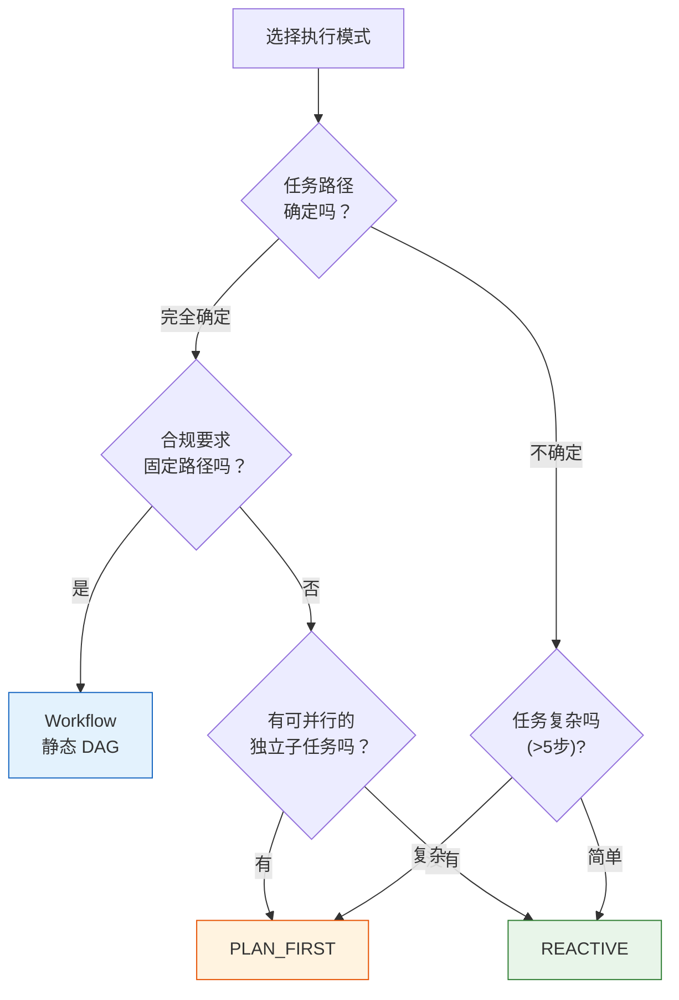

# 第 ⑥ 站：规划与 DAG

> 不是所有任务都适合"边走边想"。这一站讲清楚三种执行模式怎么选、动态 DAG 怎么做断点续跑、审批拒绝后怎么增量重规划。

---

## 问题：一种循环走天下吗？



REACTIVE 模式很灵活，但不是万能的：
- 任务有 5 个独立子任务可以并行，REACTIVE 只能串行做
- 合规审计要求按固定步骤执行，REACTIVE 可能跳过或乱序
- 长任务跑到一半中断，REACTIVE 恢复后可能重复执行已完成的步骤

prodagent 提供三种模式，按任务复杂度选择。

---

## 三种执行模式对比

| 维度 | REACTIVE | PLAN_FIRST | Workflow |
|------|----------|------------|----------|
| 规划方式 | 无，边走边想 | 模型先输出 DAG | 完全预定义 |
| 模型参与 | 每轮都参与 | 规划时参与，执行时可选 | 不参与规划 |
| 并行能力 | 单轮内只读工具并行 | DAG 节点可并行 | DAG 节点可并行 |
| 断点续跑 | checkpoint 恢复整轮 | 按节点状态恢复，已完成不重复 | 按节点状态恢复 |
| 确定性 | 低（每轮模型决策） | 中（计划固定，执行可调） | 高（完全固定） |
| 适合场景 | 探索、研究、调试 | 复杂任务、多步骤 | 合规、流水线 |
| 类比 | 开车去陌生地方 | 装修先出施工图 | 工厂流水线 |

---

## REACTIVE：边走边想

```python
agent = Agent("demo", mode=ExecutionMode.REACTIVE)
```

**执行流程**：
```
while True:
    response = llm.complete(messages)
    if response.stop_reason == "end_turn":
        return response.content
    execute_tools(response.tool_calls)
```

每一轮模型自己决定"下一步做什么"。没有预先计划，完全根据当前上下文决策。

**优点**：灵活，能应对意外情况，适合探索式任务
**缺点**：可能绕路、可能重复、长任务容易失控（靠预算兜底）

详细的循环机制见 [第 ⑤ 站：循环内核 →](05-loop.md)。

---

## PLAN_FIRST：先规划后执行

```python
agent = Agent("demo", mode=ExecutionMode.PLAN_FIRST)
```

### 执行流程



### ① 规划阶段

模型输出一个 JSON 格式的 DAG：

```json
{
  "steps": [
    {"id": "search", "action": "search", "params": {"query": "..."}, "depends_on": []},
    {"id": "analyze", "action": "analyze", "params": {}, "depends_on": ["search"]},
    {"id": "report", "action": "write_report", "params": {}, "depends_on": ["analyze"]}
  ]
}
```

每个步骤有：
- `id` — 唯一标识
- `action` — 执行什么（工具名或模型决策）
- `params` — 参数
- `depends_on` — 依赖哪些步骤

### ② 校验 DAG

- 检查是否有循环依赖（DAG 必须无环）
- 检查依赖的节点是否存在
- 检查 action 是否是已注册的工具
- 校验失败返回错误，让模型重新规划

### ③ 执行阶段

PlanExecutor 按依赖关系调度：
- 没有依赖的节点可以**并行**执行
- 有依赖的节点等前置节点完成后执行
- 每个节点执行后更新状态（PENDING → RUNNING → COMPLETED/FAILED）

### ④ 增量重规划

这是 PLAN_FIRST 最有价值的特性。当某个节点失败（比如审批被拒、工具报错），不是推倒整个计划重来，而是：

1. 标记该节点为 FAILED
2. 把失败原因告诉模型
3. 模型**只调整受影响的后续节点**，已完成的节点不动
4. 继续执行调整后的 DAG

```
原计划: A → B → C → D
执行中: A ✅ → B ❌(审批被拒)
重规划: A ✅ → B' → C' → D   (A不动，B/C/D调整)
```

**为什么不推倒重来？**
- 已完成的步骤可能有副作用（发了邮件、写了数据库），重复执行危险
- 浪费 token 和时间
- 增量重规划更高效、更安全

---

## Workflow：静态 DAG

```python
from prodagent.plan import Workflow, workflow_step

@workflow_step
def fetch_data():
    """获取数据"""
    ...

@workflow_step(depends_on=[fetch_data])
def analyze_data():
    """分析数据"""
    ...

@workflow_step(depends_on=[analyze_data])
def generate_report():
    """生成报告"""
    ...

workflow = Workflow([fetch_data, analyze_data, generate_report])
result = await workflow.run()
```

**与 PLAN_FIRST 的区别**：
- DAG 是代码预定义的，模型不参与规划
- 每个步骤是普通函数，不是模型决策
- 完全确定，适合合规要求固定路径的场景
- 可以在步骤中调用模型，但流程本身是固定的

**适合场景**：
- 合规审计（必须按法规规定的步骤执行）
- 数据流水线（ETL）
- 审批流程（固定的审批节点）

---

## DAG 的断点续跑

PLAN_FIRST 和 Workflow 都支持 DAG 级别的断点续跑。



恢复时：
1. 加载 DAG 状态（每个节点的 PENDING/RUNNING/COMPLETED/FAILED）
2. **COMPLETED 节点不重复执行**
3. RUNNING 节点重置为 PENDING（不知道执行到哪了，安全起见重做）
4. 按依赖关系继续执行

DAG 状态存在 AgentRun 里，和消息历史一起序列化到 checkpoint。

---

## 三种模式的选择决策树



**经验法则**：
- 不确定、探索性的 → REACTIVE
- 复杂、多步骤、可并行 → PLAN_FIRST
- 固定流程、合规要求 → Workflow

---

## 模式间的共享内核

三种模式看起来不同，但底层共享同一个 `Step` 原子：

```
REACTIVE:  while True: Step.run()
PLAN_FIRST: for node in ready_nodes: Step.run()  (按 DAG 调度)
Workflow:   for node in ready_nodes: function()  (可选 Step.run())
```

`Step` 的"想→做→记账"逻辑是共用的，经过了 1,182 个测试的验证。三种模式的差异只在"什么时候调用 Step"和"调用哪个 Step"。

> 这就是为什么把 kernel 从 runtime 拆出来——核心循环逻辑只写一次、测一次，三种模式共享。

---

## 代码定位

| 内容 | 源码位置 |
|------|---------|
| ExecutionMode 枚举 | `kernel/types.py` |
| ReactiveLoop | `kernel/loop.py` |
| PlanExecutor | `plan/executor.py` |
| DAG 数据结构 | `plan/dag.py` |
| Workflow | `plan/workflow.py` |
| 重规划逻辑 | `plan/replan.py` |
| Agent 装配 | `runtime/agent.py` |
| 工厂模式选择 | `runtime/factory.py` |

---

## 下一步

👉 **[第 ⑦ 站：多 Agent 协作 →](07-multiagent.md)** — 五种拓扑怎么选？统一消息平面怎么工作？

或者深入 [HITL 审批专题 →](../topics/approval.md)，看审批拒绝如何触发增量重规划。
