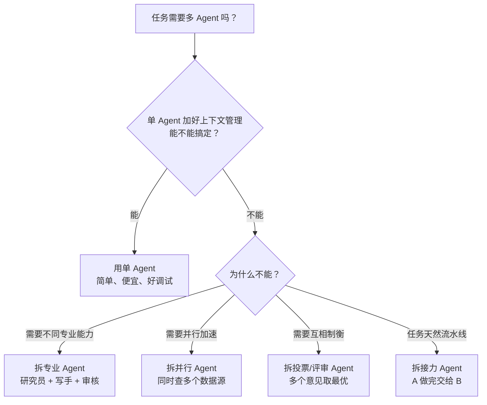
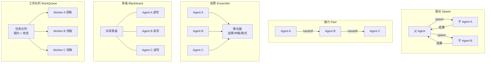
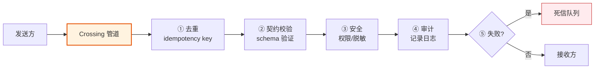
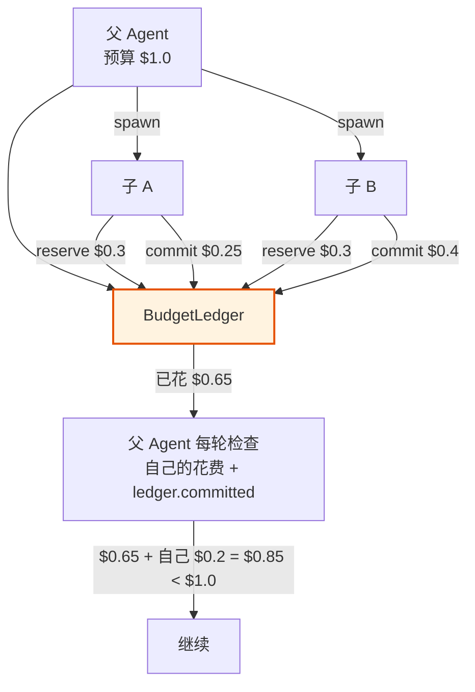
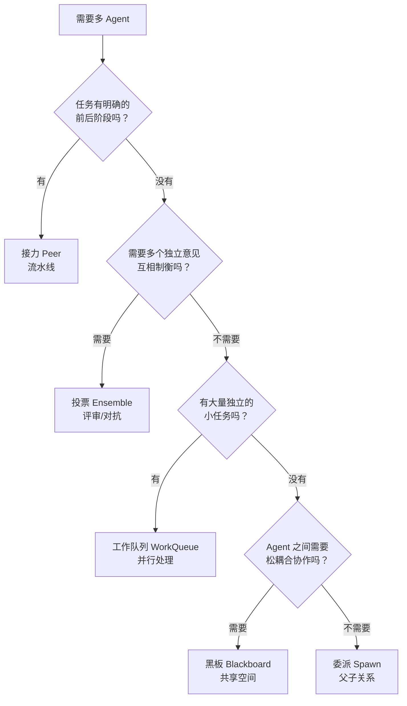

# 第 ⑦ 站：多 Agent 协作

> 什么时候该拆多 Agent？五种拓扑怎么选？Agent 间通信怎么保证不丢不重不乱序？

---

## 第一个问题：什么时候该拆多 Agent？

**答案是：能不拆就不拆。**



多 Agent 的成本：
- **更贵** — 多个 Agent 各消耗 token
- **更慢** — 通信 overhead，可能互相等待
- **更难调试** — 问题出在哪个 Agent？消息在哪丢了？
- **可能死循环** — A 推给 B，B 推回 A

所以 prodagent 的设计哲学是：**单 Agent 是默认，多 Agent 是可选的增强。**

---

## 五种协作原语

prodagent 提供五种拓扑，覆盖绝大多数多 Agent 场景：



---

### 1. 委派（Spawn）：父生子，子完成后返回

**适用场景**：父 Agent 是"项目经理"，把子任务派给"专家"执行。

```python
from prodagent.coordination.spawn import Spawn

spawn = Spawn(
    agents=[researcher, writer, reviewer],
    llm=planner_llm,
    ctx=parent_runtime,
)

result = await spawn.spawn("researcher", "调研一下 X 技术")
# 父 Agent 拿到结果，继续自己的循环
```

**特点**：
- 父子关系明确，子 Agent 完成后把结果返回给父
- 子 Agent 有独立的消息历史和工具集
- 预算通过 BudgetLedger 共享——子 Agent 花的钱计入父的总账
- 子 Agent 的审批可以传播到父（HITL 统一处理）

**类比**：老板把任务派给下属，下属做完交报告。

---

### 2. 接力（Peer）：A 做完交给 B，B 做完交给 C

**适用场景**：流水线式任务，每个 Agent 负责一个阶段。

```python
from prodagent.coordination.peer import PeerChain

chain = PeerChain([researcher, writer, reviewer])
result = await chain.run("写一篇关于 X 的文章")
# researcher → 调研 → writer → 写稿 → reviewer → 审核 → 最终结果
```

**特点**：
- 顺序执行，前一个的输出是后一个的输入
- 通过 `HandoffPacket` 传递上下文（任务摘要、关键信息、约束）
- 预算在接力链中传递——每个 Agent 花的钱累计
- 任何一个 Agent 可以决定"不接力了，直接返回"

**类比**：工厂流水线，半成品从一个工位传到下一个工位。

---

### 3. 投票（Ensemble）：多个 Agent 各出意见，聚合器裁决

**适用场景**：需要多个独立意见，取最优或投票决定。

```python
from prodagent.coordination.ensemble import Ensemble, Moderated

ensemble = Ensemble(
    agents=[agent_a, agent_b, agent_c],
    strategy=Moderated(judge=judge_agent),  # 由 judge 仲裁
)
result = await ensemble.run("这个方案有没有问题？")
```

**策略**：
- `RoundRobin` — 轮流发言
- `FreeForAll` — 自由发言，直到终止条件
- `Moderated` — 有一个主持人/裁判来仲裁

**特点**：
- 多个 Agent 共享同一个会话（看到彼此的发言）
- 终止策略控制什么时候结束（MaxRounds、共识、预算耗尽）
- 适合"三个臭皮匠"场景，也适合"红蓝对抗"

**类比**：专家评审会，每个人发言，主持人总结。

---

### 4. 黑板（Blackboard）：共享空间，Agent 自由读写

**适用场景**：多个 Agent 围绕一个共享的"问题空间"协作，各自贡献。

```python
from prodagent.coordination.blackboard import Board, BoardWrite, Trigger

board = Board()
board.add_agent(researcher, triggers=[Trigger.on_topic("data_needed")])
board.add_agent(writer, triggers=[Trigger.on_topic("data_ready")])

await board.run("解决这个问题")
```

**特点**：
- Agent 通过读写黑板通信，不直接发消息给彼此
- `Trigger` 机制——黑板上出现特定内容时触发对应 Agent
- 适合松耦合的协作，Agent 不需要知道彼此的存在
- 可以动态加入/移除 Agent

**类比**：团队共用一块白板，有人写需求，有人写方案，有人写反馈，各自看到后更新自己的部分。

---

### 5. 工作队列（WorkQueue）：任务分发，Worker 领取执行

**适用场景**：大量独立任务，多个 Worker 并行处理。

```python
from prodagent.coordination.work_queue import WorkQueue

queue = WorkQueue(workers=[worker_a, worker_b, worker_c])
queue.add_task({"id": 1, "data": "..."})
queue.add_task({"id": 2, "data": "..."})
await queue.run()
```

**关键机制**：
- **租约（Lease）** — Worker 领取任务时获得租约，超时未完成自动重新入队
- **死信（Dead Letter）** — 重试 N 次仍失败的任务进入死信队列，不阻塞其他任务
- **多租户隔离** — 不同租户的任务互不影响

**类比**：快递分拣中心，任务是包裹，Worker 是快递员，领一个送一个。

---

## 统一消息平面：Crossing

五种拓扑的通信都走同一个消息平面——`Crossing`。



**五道关卡**：
1. **去重** — 基于消息 ID 的幂等，重复消息不重复处理
2. **契约校验** — 消息必须符合预定义的 schema，格式错误直接拒绝
3. **安全** — 权限检查、敏感信息脱敏
4. **审计** — 所有消息记录日志，可追溯
5. **死信** — 处理失败的消息不丢，进入死信队列待人工处理

> 为什么所有拓扑共用一个管道？因为"不丢不重不乱序"是所有多 Agent 系统的共同需求。在一个地方解决，比在五个拓扑里各写一遍更可靠。

---

## 预算在多 Agent 中的传播

这是多 Agent 最容易出问题的地方。prodagent 用 `BudgetLedger` 统一管理：



父 Agent 的预算检查 = 自己的花费 + ledger 中所有子 Agent 的已提交花费。子 Agent 在 reserve 时就被闸门控制，不会超预算。

详细机制见 [四轴预算专题 →](../topics/budget.md)。

---

## 死循环兜底

多 Agent 最可怕的故障是"A 推给 B，B 推回 A，无限循环"。

prodagent 的多层兜底：

1. **预算硬上限** — 总预算耗尽时全部停止（最后一道防线）
2. **接力深度限制** — PeerChain 有最大跳数
3. **黑板发言次数限制** — 每个 Agent 在黑板上的发言次数有上限
4. **消息去重** — Crossing 管道的去重机制防止相同消息循环
5. **终止策略** — Ensemble 的 `MaxRounds`、`Consensus` 等策略主动终止

---

## 怎么选？决策树



---

## 代码定位

| 原语 | 源码位置 |
|------|---------|
| 委派 Spawn | `coordination/spawn.py` |
| 接力 Peer | `coordination/peer.py` |
| 投票 Ensemble | `coordination/ensemble.py` |
| 黑板 Blackboard | `coordination/blackboard.py` |
| 工作队列 WorkQueue | `coordination/work_queue.py` |
| 消息平面 Crossing | `coordination/messaging/` |
| 预算账本 | `kernel/budget.py::BudgetLedger` |
| 终止策略 | `coordination/termination.py` |

---

## 下一步

- 想看真实的多 Agent 示例？→ [9 个端到端示例 →](../examples.md)
- 想深入治理机制？→ [多 Agent 治理专题 →](../topics/governance.md)
- 想回到 tour 开头？→ [生命周期总览 →](index.md)
