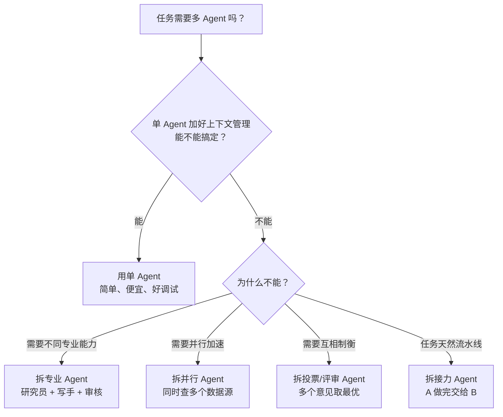
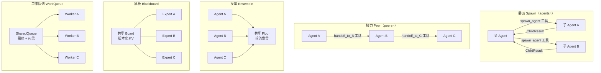
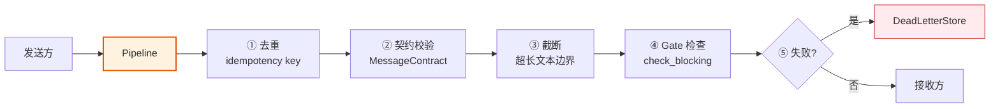
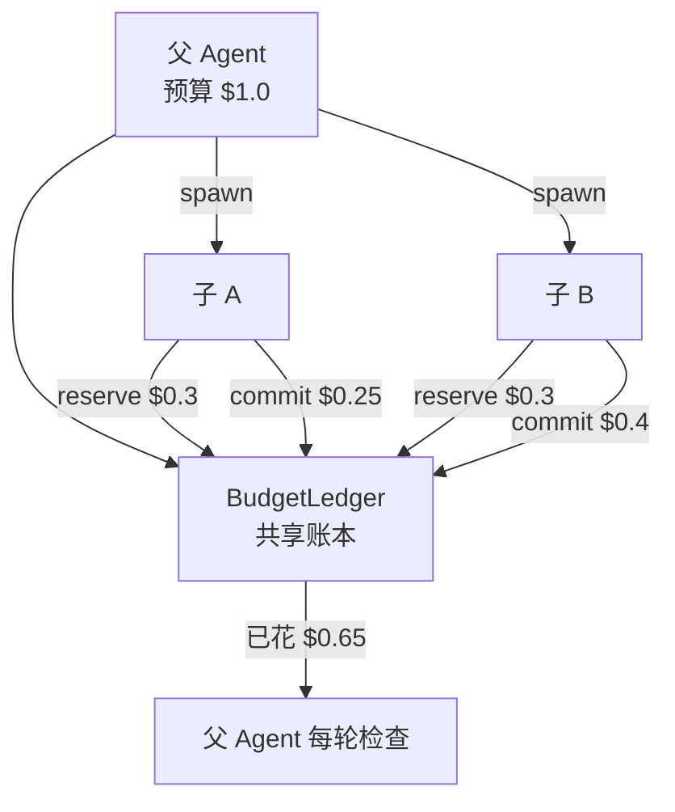
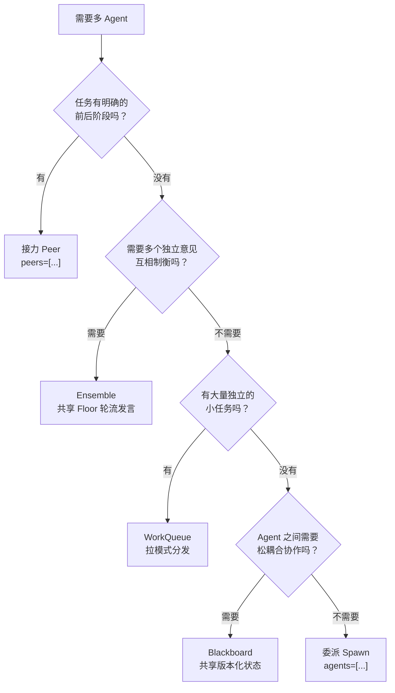

# 第 ⑦ 站：多 Agent 协作

> 什么时候该拆多 Agent？五种协作原语怎么选？Agent 间通信怎么保证不丢不重不乱序？

---

## 第一个问题：什么时候该拆多 Agent？

**答案是：能不拆就不拆。**



多 Agent 的成本：
- **更贵** — 多个 Agent 各消耗 token
- **更慢** — 通信 overhead，可能互相等待
- **更难调试** — 问题出在哪个 Agent？消息在哪丢了？
- **可能死循环** — A 推给 B，B 推回 A

所以 prodagent 的设计哲学是：**单 Agent 是默认，多 Agent 是可选的增强。**

---

## 五种协作原语

prodagent 提供五种协作原语，覆盖绝大多数多 Agent 场景。它们分为两类：

- **委派策略**（spawn / peer）——通过 Agent 的 `agents=` / `peers=` 配置，框架自动生成工具，模型在对话中决定何时调用
- **舞台拓扑**（ensemble / blackboard / work_queue）——独立的 StageDriver，通过 Spec 配置，外部驱动多轮循环

两类在调度上不同——委派由模型决定，舞台由策略决定；在执行上是同一件事：spawn 一个子 agent、让一个成员发言，都是 `RunnerPort.activate()` 的一次激活。入参 `AgentActivation` 只带可序列化字段（agent、任务、run_id、账本，或 session_id），agent 在本进程还是另一台机器上执行由端口实现决定，协作原语不感知。



---

### 1. 委派（Spawn）：父生子，子完成后返回

**适用场景**：父 Agent 是"项目经理"，把子任务派给"专家"执行。

```python
# spawn 通过 AgentConfig.agents 配置，框架自动生成 spawn_<name> 工具
researcher = Agent("researcher", system_prompt="你是研究员", tools=[search])
writer = Agent("writer", system_prompt="你是写手", tools=[write_file])

parent = Agent(
    "manager",
    system_prompt="你是项目经理，用 spawn_agent 委派任务",
    config=AgentConfig(
        name="manager",
        agents=[researcher, writer],  # ← 子 Agent 列表
    ),
)
# 模型在对话中决定调用 spawn_agent(agent_name="researcher", task="调研 X")
# 子 Agent 独立执行，完成后返回 ChildResult 给父
```

**特点**：
- 父子关系明确，子 Agent 完成后把结果返回给父
- 子 Agent 有独立的消息历史和工具集
- 模型看到的子 Agent 名册由 `Agent.spec()` 投影生成，远程 roster 传递的也是同一种格式
- 子 Agent 经 `RunnerPort` 执行，本跳的 hooks / checkpoint / 账本由进程内实现持有
- 预算通过 BudgetLedger 共享——子 Agent 花的钱计入父的总账
- 子 Agent 的审批可以传播到父（HITL 统一处理）
- 父 Agent 在等待子 Agent 期间保持运行，不阻塞

**类比**：老板把任务派给下属，下属做完交报告。

---

### 2. 接力（Peer）：A 做完交给 B，B 做完交给 C

**适用场景**：流水线式任务，每个 Agent 负责一个阶段。

```python
# peer 通过 AgentConfig.peers 配置，框架自动生成 handoff_to_<name> 工具
researcher = Agent("researcher", system_prompt="你是研究员")
writer = Agent("writer", system_prompt="你是写手")
reviewer = Agent("reviewer", system_prompt="你是审核员")

first = Agent(
    "researcher",
    system_prompt="你是研究员，调研完用 handoff_to_writer 交接",
    config=AgentConfig(
        name="researcher",
        peers=[writer, reviewer],  # ← 可接力的 Agent 列表
    ),
)
# 模型调用 handoff_to_writer(task="写一篇关于 X 的文章", input_refs={...})
# 当前 Run COMPLETED，writer 带着任务和前一个 Agent 的输出继续
```

**特点**：
- 顺序执行，前一个的输出通过 `HandoffPacket` 传给后一个
- relay 决定链要不要继续、交给谁，返回 `HandoffActivation`；peer 的查找与 fork 由驱动方完成，协作层不构造运行时对象
- handoff 工具的 meta 标记为 `domain="orchestration"`
- 当前 Agent Run 以 COMPLETED 状态结束，peer 继续
- 支持 SUSPENDED 状态的 peer 恢复（审批挂起场景）

**类比**：工厂流水线，半成品从一个工位传到下一个工位。

> **注意**：源码中的类名是 `Peer`（不是 `PeerChain`）。用户通常不直接实例化它，而是通过 `peers=[...]` 配置，框架自动构建 handoff 工具。

---

### 3. Ensemble：多个 Agent 共享会话，轮流发言

**适用场景**：需要多个独立意见，取最优或投票决定。

```python
from prodagent.coordination.ensemble import (
    EnsembleSpec, Ensemble, ensemble_stream,
    AgentFloorMember, RoundRobin, Moderated, FreeForAll,
)
from prodagent.coordination.termination import TerminationPolicy, MaxRounds

# 1. 把 Agent 包装成 FloorMember
members = [
    AgentFloorMember(agent_a, session_id="debate-1"),
    AgentFloorMember(agent_b, session_id="debate-1"),
    AgentFloorMember(agent_c, session_id="debate-1"),
]

# 2. 配置 Ensemble
spec = EnsembleSpec(
    members=members,
    topic="这个方案有没有问题？",
    order=RoundRobin(),              # 轮流发言（默认）
    # order=Moderated(picker=judge), # 或由裁判指定下一个发言者
    # order=FreeForAll(),            # 或所有人每轮并发发言
    termination=TerminationPolicy(hard_cap=MaxRounds(max_rounds=5)),
)

# 3. 驱动并流式获取事件
async for event in ensemble_stream(spec):
    if isinstance(event, FloorTurnEvent):
        print(f"{event.turn.speaker}: {event.turn.text}")
    elif isinstance(event, EnsembleCompletedEvent):
        print(f"结束原因: {event.reason}")
```

**三种发言顺序**：

| 策略 | 行为 | 适用场景 |
|------|------|---------|
| `RoundRobin` | 按成员顺序轮流，循环往复 | 有序讨论、评审 |
| `Moderated(picker=...)` | async picker 函数指定下一个发言者；返回 None 结束 | AutoGen selector 模式、主持人仲裁 |
| `FreeForAll` | 每轮所有成员并发发言 | 头脑风暴、并行意见收集 |

**特点**：
- 多个 Agent 共享同一个 Floor（发言记录），看到彼此的发言
- `[FLOOR]` 块通过视图注入器进入每个成员的上下文（L2 层，和记忆同层）
- 默认 `PublicTextOnly` 投影——工具调用不泄露到共享记录
- 终止策略：`MaxRounds` 硬上限 + 可选业务策略（共识、预算等）
- 共享 BudgetLedger，一个成员超预算不影响其他成员已完成的发言
- 成员发言经 `RunnerPort` 激活（默认 `InProcessChatRunner`），注入自定义 runner 可把成员放到远端

**类比**：专家评审会，每个人发言，主持人总结。

---

### 4. Blackboard：共享版本化状态，声明式触发

**适用场景**：多个 Agent 围绕一个共享的"问题空间"协作，各自贡献。

```python
from prodagent.coordination.blackboard import (
    BlackboardSpec, Blackboard, blackboard_stream,
    AgentBlackboardMember, Trigger, BoardWrite,
)

# 1. 把 Agent 包装成 BlackboardMember（每个绑定一个写入 key）
experts = {
    "researcher": AgentBlackboardMember(researcher_agent, session_id="bb-1",
                                        write_key="research"),
    "writer": AgentBlackboardMember(writer_agent, session_id="bb-1",
                                    write_key="draft"),
    "reviewer": AgentBlackboardMember(reviewer_agent, session_id="bb-1",
                                      write_key="review"),
}

# 2. 配置触发器：哪些 key 变化时触发哪些 expert
triggers = {
    "kickoff": Trigger(name="kickoff", keys=[], experts=["researcher"]),  # 空 keys = 每轮触发
    "research_done": Trigger(name="research_done", keys=["research"],
                             experts=["writer"]),
    "draft_done": Trigger(name="draft_done", keys=["draft"],
                          experts=["reviewer"]),
}

# 3. 配置 Blackboard
spec = BlackboardSpec(
    experts=experts,
    triggers=triggers,
    terminal_check=lambda board: "review" in board.read(),  # review key 写入即完成
)

# 4. 驱动
async for event in blackboard_stream(spec):
    if isinstance(event, BoardWriteEvent):
        print(f"{event.write.author} → {event.write.key}")
```

**Trigger 机制**：

```python
@dataclass(frozen=True)
class Trigger:
    name: str
    keys: list[str]           # 监听的 board key（支持 fnmatch 通配符）；空列表 = 每轮触发
    experts: list[str]        # 触发时激活的 expert
    mode: Literal["event", "buzz_in"] = "event"
    # "event"  = 所有匹配的 expert 并发执行
    # "buzz_in" = 通过锁竞争，只有一个 expert 执行（抢答模式）
```

**特点**：
- Board 是版本化的 `dict[str, BoardSlot]`，写入用乐观并发控制
- Expert 通过 `try_contribute(board, trigger=...)` 贡献，返回 `BoardWrite` 或 `None`
- `[BOARD]` 块通过视图注入器进入 expert 上下文
- 版本冲突的写入进入死信队列，不杀死整个黑板
- 支持 per-key 的消息契约（MessageContract）校验

**类比**：团队共用一块白板，有人写需求，有人写方案，有人写反馈，各自看到后更新自己的部分。

---

### 5. WorkQueue：拉模式任务分发

**适用场景**：大量独立任务，多个 Worker 并行处理。

```python
from prodagent.coordination.work_queue import (
    WorkQueueSpec, WorkQueue, work_queue_stream,
    WorkItem, WorkResult, Worker,
)

# 1. 定义 Worker（实现 Worker 协议）
class AgentWorker:
    def __init__(self, agent):
        self.agent = agent

    async def try_claim_and_run(self, queue, *, name):
        item = await queue.claim_next(name)
        if item is None:
            return None
        try:
            result = await self.agent.chat(str(item.payload))
            await queue.complete(item.item_id)
            return WorkResult(item_id=item.item_id, outcome="success",
                             cost_usd=result.cost_usd)
        except Exception as exc:
            outcome, attempts = await queue.fail(item.item_id, str(exc))
            return WorkResult(item_id=item.item_id, outcome="failure", error=str(exc))

# 2. 配置 WorkQueue
spec = WorkQueueSpec(
    workers={
        "worker-1": AgentWorker(agent_1),
        "worker-2": AgentWorker(agent_2),
    },
    items=[WorkItem(item_id="1", payload="任务 A"),
           WorkItem(item_id="2", payload="任务 B")],
    lease_seconds=30.0,       # 租约超时
    # event_log=...,          # 可选：持久化事件日志，支持崩溃恢复
    # run_id="queue-1",       # 事件日志分区键
)

# 3. 驱动
async for event in work_queue_stream(spec):
    print(event)  # ItemClaimedEvent / ItemCompletedEvent / ItemRequeuedEvent / ...
```

**关键机制**：

| 机制 | 作用 |
|------|------|
| **租约（Lease）** | Worker 领取任务后有 30 秒租约，超时未完成自动重新入队 |
| **死信（Dead Letter）** | 重试 N 次（默认 3）仍失败的任务进入死信队列，不阻塞其他任务 |
| **事件溯源** | 可选 EventLog，每次状态变更追加事件，崩溃后通过 `SharedQueue.restore()` 重建 |
| **拉模式** | Worker 主动 `claim_next()`，不是 push——空闲 Worker 自然竞争，负载均衡 |

**类比**：快递分拣中心，任务是包裹，Worker 是快递员，领一个送一个。

---

### 三种舞台共用的排班：Activation

三种舞台拓扑每一轮都在回答同一个问题：这轮谁上、怎么上。这个答案是一张统一的单子（`ports/activation.py`）：

```python
@dataclass(frozen=True)
class Activation:
    members: list[str]          # 这轮谁上
    dispatch: "serial" | "concurrent" | "single_winner"
    round_num: int = 0          # 第几轮
    label: str = ""             # 为什么叫他们（触发器名、顺序名，日志用）
```

| dispatch | 行为 | 谁在用 |
|---------|------|--------|
| `serial` | 逐个、按顺序 | RoundRobin、Moderated 的单发言者 |
| `concurrent` | 全体并发，结果按成员顺序收集 | FreeForAll、Blackboard 的触发扇出、WorkQueue 的认领竞争 |
| `single_winner` | 全体竞争，只有一个执行，输家零开销 | Blackboard 的 buzz_in 抢答 |

解释这张单子的只有一个地方：`StageDriver._dispatch`（`coordination/stage.py`）。并发批的 fail-fast 取消、抢答的先抢锁再干活，都只写一遍，三种拓扑共享。新增一种协作玩法（LLM 主持人、优先级队列），只需要实现 `ActivationPolicy` 回答"这轮谁上"，不用再写一个轮循环。

---

## 统一消息平面：Crossing

五种原语的通信都走同一个消息平面——`Crossing` 信封 + `Pipeline` 管道。



**核心概念**：
- **Crossing** — 消息信封，携带 direction（UPSTREAM/DOWNSTREAM）、kind（SPEECH/WRITE/DISPATCH/TASK_RESULT）、from/to、payload、trace_id
- **Pipeline** — 拦截器链，按 Slot 位置挂载（去重、契约、截断、Gate）
- **Transport** — 端口，进程内实现，可替换为 Redis/NATS 等
- **DeadLetterStore** — 处理失败的消息存档

> 为什么所有拓扑共用一个管道？因为"不丢不重不乱序"是所有多 Agent 系统的共同需求。在一个地方解决，比在五个拓扑里各写一遍更可靠。

---

## 预算在多 Agent 中的传播

这是多 Agent 最容易出问题的地方。prodagent 用 `BudgetLedger` 统一管理：



三阶段记账：
- **reserve** — 开始工作前预占，让兄弟 Agent 看到这笔钱已被预定
- **commit** — 工作完成后用真实花费替换预占
- **release** — 预占了但没花（锁竞争失败等），退还

详细机制见 [四轴预算专题 →](../topics/budget.md)。

---

## 死循环兜底

多 Agent 最可怕的故障是"A 推给 B，B 推回 A，无限循环"。

多层兜底：
1. **预算硬上限** — 总预算耗尽时全部停止（最后一道防线）
2. **终止策略** — Ensemble 的 `MaxRounds`、Blackboard 的 `terminal_check`、WorkQueue 的 `is_drained`
3. **消息去重** — Crossing 管道的幂等去重防止相同消息循环
4. **无进展检测** — Blackboard/WorkQueue 检测 fingerprint 不变时主动终止
5. **Peer handoff 不是循环** — handoff 后当前 Run COMPLETED，不会回到前一个 Agent

---

## 怎么选？决策树



---

## 代码定位

| 原语 | 源码位置 |
|------|---------|
| 委派 Spawn | `coordination/spawn.py`（通过 `agents=[...]` 配置） |
| 接力 Peer | `coordination/peer.py`（通过 `peers=[...]` 配置） |
| Ensemble | `coordination/ensemble.py` |
| Blackboard | `coordination/blackboard.py` |
| WorkQueue | `coordination/work_queue.py` |
| 消息平面 Crossing | `coordination/messaging/` |
| Floor（Ensemble 共享状态） | `coordination/floor.py` |
| 终止策略 | `coordination/termination.py` |
| 预算账本 | `kernel/budget.py::BudgetLedger` |
| StageDriver 基类 | `coordination/stage.py` |
| Activation 排班 | `ports/activation.py` |
| RunnerPort（激活执行） | `ports/runner.py` |
| AgentSpec 投影 | `ports/agent_spec.py` |

---

## 下一步

- 想看真实的多 Agent 示例？→ [9 个端到端示例 →](../examples.md)
- 想深入治理机制？→ [多 Agent 治理专题 →](../topics/governance.md)
- 想回到 tour 开头？→ [生命周期总览 →](index.md)
