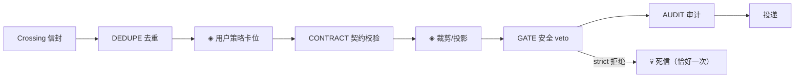

# ⑦ 协作 coordination

多 Agent 的核心难题：状态要穿过 Agent 边界。子 Agent 的输出流进父的
上下文，接力棒带着前一段对话，发言进入共享的地板——每条穿越都是
注入面、一致性风险和观测盲区。本框架的回答是把所有穿越统一成一条
消息平面。

## Crossing：一切穿越的形状

```python
# src/prodagent/coordination/messaging/envelope.py:89（节选）
@dataclass(frozen=True)
class Crossing(Generic[T]):
    direction: Direction      # DOWNSTREAM（下发任务）/ UPSTREAM（上交结果）
    kind: CrossingKind        # dispatch / handoff / result / speech / write / enqueue / task_result
    from_agent: str
    to: str
    payload: T                # 类型化载荷，永不拍平成 dict
    trace_id: str
    message_id: str
```

五种协作原语——`agents=` 垂直委派、`peers=` 横向接力、`Ensemble` 共享
会话、`Blackboard` 共享看板、`WorkQueue` 任务池——**每一次** Agent 边界
穿越都铸成 Crossing，流经同一条固定卡位的管道：



两个 `◈` 是留给用户的语义卡位（注入规则、LLM 裁判）；框架只出机制
（`messaging/pipeline.py:181` 的 `admission_pipeline` 上行 /
`assembly_pipeline` 下行）。被拒的穿越进死信信箱——**恰好记一次**，
不是丢掉。五个原语因此共享同一套治理：给一条管道写策略，等于给
所有拓扑写了策略。

## 两个轻原语：树与链

- **`agents=`（`coordination/spawn.py`）**——父把任务派给子。子跑完，
  结果经 admission 管道**净化后**返回：白名单视图 + 记账标量，
  `tool_history` 之类不跨边界。子花销实时汇入父的预算（树形账本）。
- **`peers=`（`runtime/runner.py`）**——上一站的 RunLoop 循环
  就是在等它：`pending_handoff` 出现时 fork peer、以它为根跑下一跳。
  接力棒 `HandoffPacket` 带 `message_id`，重复投递被 DEDUPE 吞掉。

## 三个舞台原语：共享状态的两种写法

剩下的三个原语共享一个“舞台驱动器”底座（`_stage.py`），区别只在
**共享状态怎么写、谁被唤醒**：

| 原语 | 共享状态 | 唤醒 | 语义要点 |
|---|---|---|---|
| `Ensemble`（`ensemble.py:367`） | `SharedFloor` 追加式转录 | 轮流/主持人选人/全员并发 | 发言进地板前过 admission；毒发言死信记一次，地板不死 |
| `Blackboard`（`blackboard.py:85`） | `Board` 版本化槽位 | `Trigger` 字段变化触发 | 并发写同槽 = `BoardVersionConflict`，**输者死信隔离，看板存活** |
| `WorkQueue`（`work_queue.py:378`） | 租约队列 | worker 主动领活 | 租约超时回收重排；重试封顶进死信 |

Blackboard 有个值得注意的细节：`BoardVersionConflict` **不是** core 的
`VersionConflict`（checkpoint/session 的乐观并发）——它们是两个概念，
统一反而坏事：异常族 `AgentError` 会触发舞台驱动器的终止守卫，把
“输了一步棋”变成“掀翻棋盘”。不同的概念用不同的名字，这是
[设计决策](../decisions.md)里的一个条目。

## 取舍

**不做成通用 actor/graph 引擎？** 因为五个原语已经覆盖了
“共享状态 × 激活策略”这个二维空间的全部实用格点，而每个原语的语义
可以一页讲清。通用引擎的方向是让任意拓扑可表达——代价是没有任何
拓扑可审计。本框架的立场：拓扑是**读出来的**（五个名字各有语义），
不是**拼出来的**（N 条边没有语义）。

