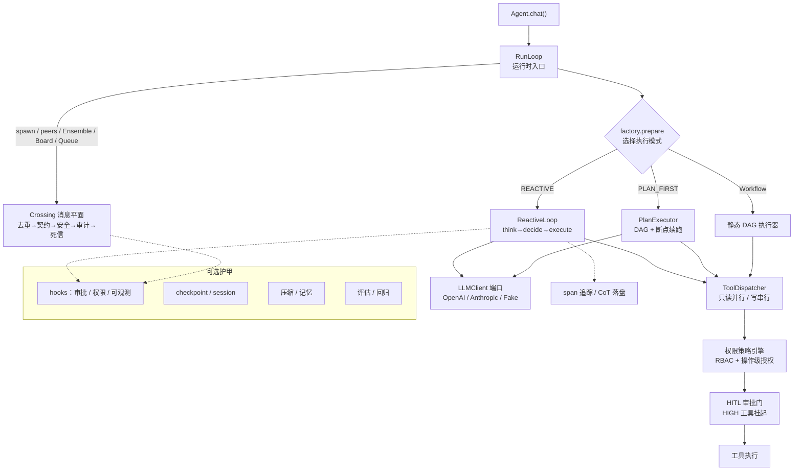
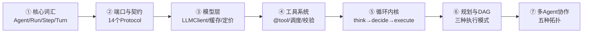

# 第一部分 · 一次调用的生命周期

> 用七站走完一条完整链路。每站对应源码里的一个包，读完你能在白板上画出整个 Agent 的运行时架构。

---

## 全景图

在深入每个模块之前，先建立全局视野。一次 `agent.chat("任务")` 调用，在 prodagent 内部经历了这些层：

---

## 七站路线

### 每站你将学会什么

| 站 | 核心问题 | 读完能回答 |
|----|---------|-----------|
| ① 核心词汇 | 这些概念到底是什么关系？ | "一个 Run 有多少 Step？Turn 和 Step 有什么区别？" |
| ② 端口与契约 | 为什么用 Protocol？后端怎么替换？ | "我想把 checkpoint 从 file 换成 postgres，要改多少代码？" |
| ③ 模型层 | LLM 调用怎么抽象？缓存怎么计费？ | "为什么 cache_read 不计入 token 预算？" |
| ④ 工具系统 | 工具怎么定义？参数怎么校验？ | "模型传错参数了，框架怎么处理？" |
| ⑤ 循环内核 | 一次 think→decide→execute 到底做了什么？ | "死循环怎么检测？预算在哪一步检查？" |
| ⑥ 规划与 DAG | 三种模式怎么选？DAG 怎么断点续跑？ | "什么时候该用 PLAN_FIRST 而不是 REACTIVE？" |
| ⑦ 多 Agent 协作 | 五种拓扑怎么选？消息怎么保证不丢？ | "委派和接力有什么区别？什么时候该拆多 Agent？" |

---

## 阅读建议

### 方式一：顺序阅读（推荐初学者）

从 ① 到 ⑦ 依次读完。每站都建立在前一站的概念之上，顺序阅读不会有知识断层。

### 方式二：按需跳转（推荐有经验者）

如果你已经熟悉 Agent 基础概念，可以直接跳到你关心的站点：

- 关心**稳定性** → ⑤ 循环内核 + [预算专题](../topics/budget.md) + [恢复专题](../topics/recovery.md)
- 关心**多 Agent** → ⑦ 多 Agent 协作 + [治理专题](../topics/governance.md)
- 关心**工程化** → ② 端口与契约 + [可观测专题](../topics/observability.md)

### 方式三：源码对照阅读

每一站都标注了对应的源码包。建议打开源码对照阅读——这个框架的代码注释质量很高，注释解释的是"为什么"而不是"做什么"。

---

## 开始

👉 **[第 ① 站：核心词汇 →](01-core.md)**
