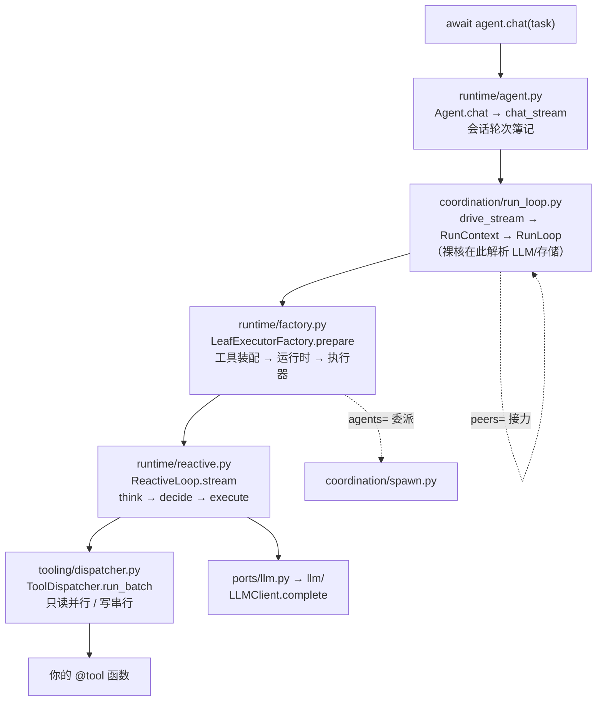

# 一次调用的旅程 · 总览

读框架源码最好的路线是跟着一次调用走：`await agent.chat("...")` 之后
发生了什么。这条路径上没有可选的支线。七站走完，你得到的是一套完整的
心智模型——能在白纸上画出运行时架构，说清每一层为什么存在、去掉会怎样、
替代方案是什么。

## 全链路

## 七站地图

| 站 | 包 | 你会读懂什么 | 关键文件 |
|---|---|---|---|
| [① 词汇](01-core.md) | `core/` | 所有层共说的语言：类型、运行状态、预算、错误 | `core/types.py`、`core/state/run.py`、`core/budget.py` |
| [② 契约](02-ports.md) | `ports/` | 14 个 Protocol：先立契约，再谈实现 | `ports/__init__.py`、`ports/llm.py` |
| [③ 模型](03-llm.md) | `llm/` | provider 怎么选、FakeLLM 为什么是一等公民 | `llm/providers.py`、`llm/fake.py` |
| [④ 工具](04-tools.md) | `tooling/` | `@tool` 的元数据、分发管道、批执行语义 | `tooling/decorator.py`、`tooling/dispatcher.py` |
| [⑤ 循环](05-loop.md) | `runtime/` | Agent 两段式构造与 REACTIVE 主循环 | `runtime/agent.py`、`runtime/reactive.py` |
| [⑥ 规划](06-plan.md) | `plan/` | PLAN_FIRST 的 DAG、断点续跑、增量重规划 | `plan/executor.py`、`plan/dag.py`、`plan/workflow.py` |
| [⑦ 协作](07-multiagent.md) | `coordination/` | spawn/peers 与 Crossing 消息平面、三舞台原语 | `coordination/run_loop.py`、`spawn.py`、`messaging/` |

每站开头是真实代码（注明 `文件:行号`），建议开着仓库对照读；结尾一节
**取舍**讲这一站最容易走错的岔路。恢复、审批、压缩这些能力不在这条
路上——它们是 `chat()` 之外的插件位，在[第二部分 · 专题](../topics/recovery.md)
各成一章，你会在接口处看到它们的名字，但不会被拉进去。
