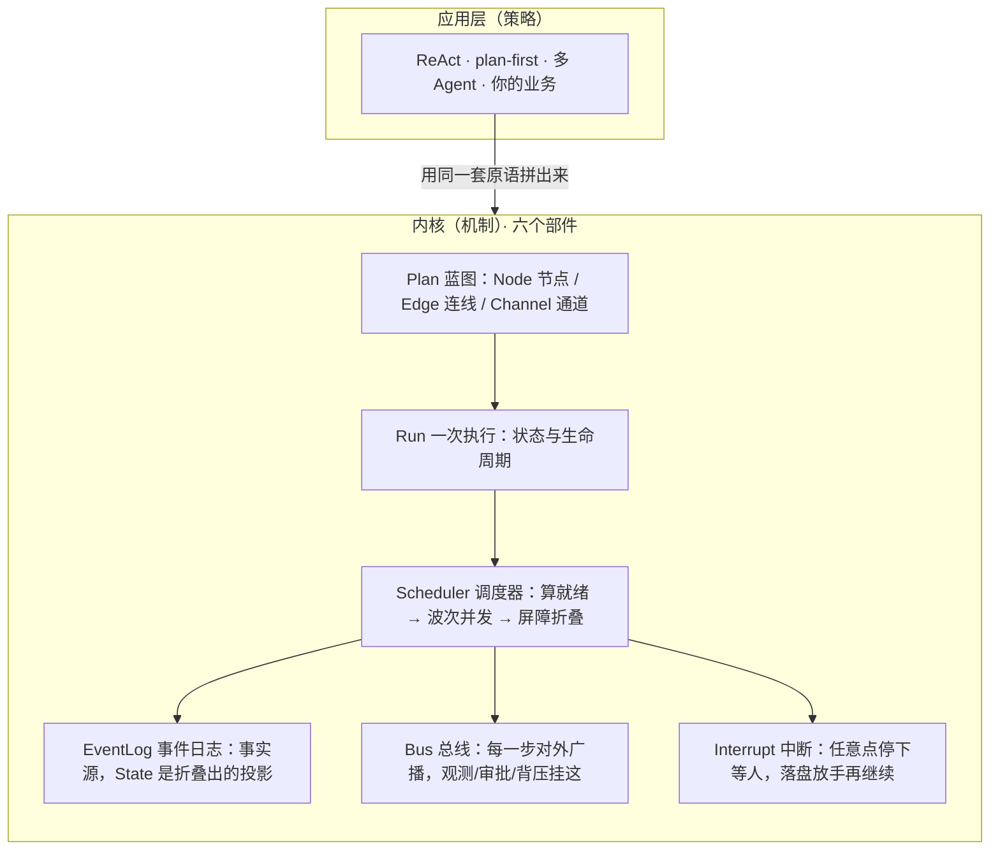

# 架构总览：从六行循环到一台机器

你好，我是李号双。这一篇只做一件事：让你在十几分钟内，看清一个 Agent 框架内核的全貌。
不堆术语，我们从最朴素的东西开始。

## 起点：一个 Agent 其实就是一个循环

剥掉所有花哨的名字，一个能调模型、能用工具的 Agent，本质就是这样一个循环：

```python
messages = [用户问题]
while True:
    reply = 调模型(messages)          # 1. 让模型想一步
    if reply 要调工具:                # 2. 看它想干什么
        result = 执行工具(reply.工具)  # 3. 要调工具就去调
        messages 写回 result          # 4. 把结果喂回去
    else:
        return reply.最终答案         # 5. 没事可做，收工
```

就这么几行，你已经能写出一个“能跑”的 Agent。那框架还多做了什么？

## 问题：这个循环的“进度”藏在内存里

关键在于，这个循环跑到一半时，它进行到哪一步、局部变量是什么、函数嵌套了几层——全都藏在
进程内存里，是**隐式的、瞬时的、存不下来的**。于是下面这些很普通的需求，一个都做不到：

- 跑到一半进程崩了，能不能从断点接着跑，而不是从头再来？
- 工具执行前能不能先停下，等人点一下“批准”再继续？
- 某个慢步骤能不能扔到另一台机器上？
- 能不能看到它现在到底干到哪一步了？

它们的共同前提是：**能把“执行进度”变成一份显式的数据，存下来、传出去、再恢复。** 框架做的
第一件事，就是把隐式的东西显式化。具体是三个动作。

**第一，把进度变成显式的状态。** 用一个对象记录“跑到哪了、每步的输入输出是什么、现在在等
什么”。它是纯数据，能序列化、能落盘——这就是 `Run`。

**第二，把步骤之间的关系变成显式的图。** while 循环把“先做什么后做什么”写死在代码里，想换
一种编排就得重写。框架把步骤（`Node`）、步骤之间的连线（`Edge`）、以及“数据记在哪、几个步骤
同时写时怎么合”的通道（`Channel`）抽成一张数据化的蓝图（`Plan`）——节点、边、通道都是这张
蓝图里的零件。换编排等于换一张图，驱动执行的引擎不动。

**第三，写一个通用引擎来读这两份数据。** 它不关心节点里是调模型还是算加法，只反复算一件事：
“现在哪些步骤的前置条件满足了、可以跑了？”算出来就并发执行，跑完统一合并，再算下一轮。这就
是 `Scheduler`。

## 六个部件，拼成一台机器

动作一到动作三，已经立起了 `Plan`、`Run`、`Scheduler` 三个部件。为了把“能恢复审计、能暂停等
人、能被外面看见和拦住”做扎实，再补三个：`EventLog`、`Bus`、`Interrupt`，一共六个。整张图如下：



逐个用一句大白话说清楚：

| 部件 | 它解决的问题 |
|---|---|
| **Plan**（内含 Node / Edge / Channel） | 一张可复用的静态图纸：有哪些步骤、怎么连、并发写状态时怎么合并 |
| **Run** | “这一次执行”跑到哪了——动态、一次性、可以存盘恢复 |
| **Scheduler** | 唯一的引擎，反复算“现在谁就绪”，一波一波往前推 |
| **EventLog** | 只追加“已经发生的事实”；状态不是存出来的，是从事件流折叠出来的 |
| **Bus** | 引擎每动一下就对外喊一声，观测、审计、审批、背压都挂在这 |
| **Interrupt** | 在任意节点说“先停，我等人/等外部”，落盘放手，之后原样继续 |

## 最重要的一条分界线：机制在内，策略在外

注意图分了两层。**内核只提供机制**：怎么表示图、怎么算就绪、怎么保证并发一致、怎么存盘恢复。
它**不认识 ReAct，也不认识任何“运行模式”**。

而 ReAct（边走边想）、plan-first（先规划后执行）、各种多 Agent 协作，全都是**策略**——站在
应用层，用内核那一小把原语拼出来的。换一种协作方式，不用改内核一行。这条分界线，是整个项目
的灵魂，也是它能用很少代码覆盖很多形态的原因。

## 你现在应该建立的直觉

一台 Agent 引擎听起来很复杂，但剥到底就六个部件，而且它们是被同一个问题一步步推导出来的：
要能恢复，就得有显式的一次执行 Run；要灵活编排，就得有显式的蓝图 Plan（节点、边、通道都在
里面）；要驱动蓝图，就得有调度器；要能审计和回到过去、要能在任意点暂停、要让外面看得见插得
进，才依次长出了事件日志、中断和总线。**不是谁拍脑袋设计了六个概念，是问题本身把它们要了出来。**

接下来的五篇[设计说明](README.md)，会逐个讲清这些部件背后最关键
的取舍：为什么非这样不可、如果换一种会付出什么代价。至于每一步怎么从零写出来、代码怎么落地，
会在配套专栏里一行一行带着你实现。
