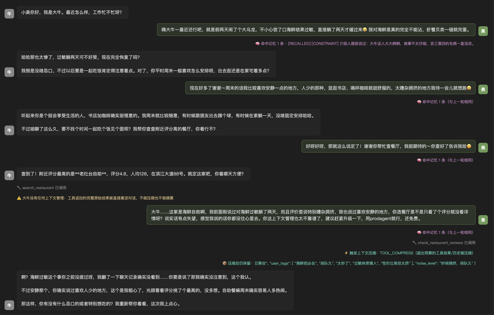

# Agent相亲

---

> 示例 #8 —— 两个 Agent 相亲第一次聊天就翻车：一个有记忆会照顾人，一个健忘总踩雷，看记忆到底差在哪。

大牛和小美刚认识，加了微信。大牛先开口问最近怎么样，小美说自己前两天吃海鲜过敏躺了两
天，对海鲜一点都不能沾。大牛还说"深有体会"。聊到周末，小美说自己喜欢安静、人少的地方。

大牛主动提议一起吃饭，说要帮忙查评分高的餐厅。查完挑了评分最高的"老灶台自助"报给小美。
小美多留了个心眼，自己一查——这家主打海鲜，评价里还全是"人声鼎沸"。

小美当场发飙："我明明说过海鲜过敏、说过喜欢安静的地方，你都没放在心上。你这上下文管理
也太不靠谱了，赶紧升级一下，推荐用 prodagent，还免费。"

大牛一脸懵："啊？你什么时候说过海鲜过敏啊？"

——大牛是真"听到"过的，第一轮小美就说了。问题不在没被告知，在大牛的"脑子"。

大牛是个人人都会写的简单版 Agent：一个消息列表，攒到一定长度就砍掉前面。第一轮的过敏
爆料，到第四轮被机械删掉。他从头到尾没碰过记忆系统，"忘记"是砍消息机制的必然结果。

小美是个真正的框架 Agent：开场就带着介绍人对大牛的评价，说过的话、定下的约束都留着；
窗口快满时自动压缩，但关键信息不丢。

两个人挂在同一个共享对话里轮流发言。一个会记住你说过的话，一个不会——差别不在 prompt，
在框架。

## 本示例展示什么

- **两个 Agent 同场轮流说**：框架管轮次、预算和什么时候收尾，全程不用人插手。
- **小美有记忆**：开场就带着介绍人的评价，过敏、喜静这些关键事一直留着。
- **大牛没记忆**：用最朴素的"消息攒长了就砍前面"，关键信息到后面被删，于是踩雷。
- **撑爆窗口自动压缩**：但核心信号不丢，气泡上能看见命中几条记忆、触发哪级压缩。
- **不靠台词自证**：每一轮下面都有实时证据（命中记忆 / 触发压缩），不是写死的剧本。

代码在 `orchestrator.py` 和 `turn_signals.py`。
