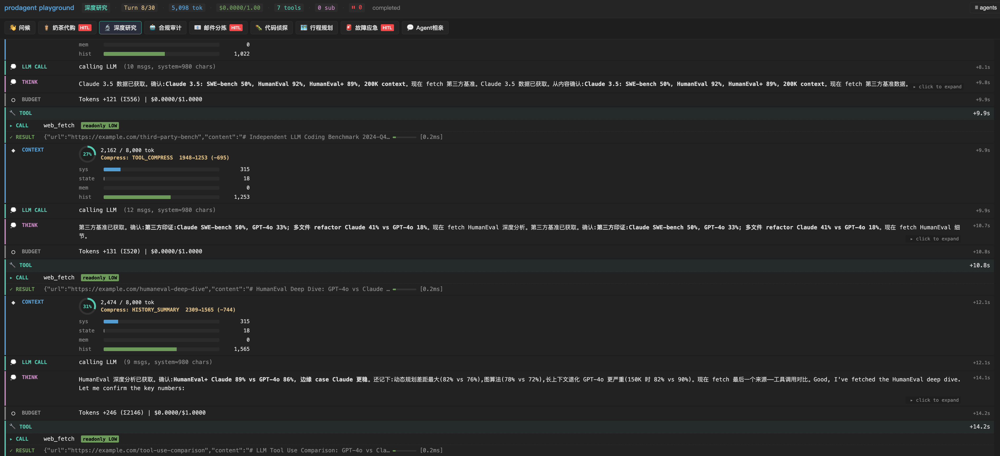

# 深度研究

> 让 Agent 做深度研究，最容易翻车的不是搜索，是上下文。

跑十轮 fetch，每轮结果几千字塞进 messages，到第六轮 LLM 已经忘了第一轮查到的
数字。你让它写报告，它把第三轮的结论和第八轮的数据张冠李戴——不是模型蠢，是
上下文窗口被撑爆后早期信号被挤出去了。

常见的"省事"做法是截断：`del messages[:-10]`，留最近十条。问题是大模型可能再
也回忆不起研究一开始的关键发现，报告后半段就开始编。

prodagent 的 deep_research 示例演示另一种做法：

- **REACTIVE 多轮探索** —— 每 turn 看上一步结果决定下一步搜什么，不预先写死
  DAG。fetch → 读内容 → 记数字 → fetch 下一页 → 综合。
- **五级压缩** —— 历史爆窗口时，`NONE → TOOL_COMPRESS → HISTORY_SUMMARY`
  自动触发。早期对话被总结成摘要，关键 claim 不丢，LLM 还能引用。
- **SkillRegistry** —— `deep-research.md` runbook 常驻，LLM 调 `get_skill` 加载
  探索流程，不用每次重学。

跑 `examples/deep_research`，控制台直接看到压缩级别切换：`TOOL_COMPRESS` 把长
工具结果压成 head+tail，`HISTORY_SUMMARY` 把早期多轮对话总结成一段。LLM 最后
写报告时还能准确引用第一轮 fetch 的数字——因为压缩没把核心信号一起丢掉。

让 Agent 长跑而不失忆，靠的是框架，不是 prompt。

---

> 示例 #3 —— REACTIVE 多轮探索 + context 压缩。

agent 拿到研究问题后,不预先写死 plan,而是多轮探索:每 turn 看上一步
结果决定下一步。

1. **REACTIVE 探索** —— fetch → 读内容 → 记数字 → fetch 下一页 → 综合。
   路径由结果决定,不是预先 DAG。
2. **context 压缩** —— 长跑后历史 + 工具结果累积超阈值,框架自动从
   NONE → TOOL_COMPRESS → HISTORY_SUMMARY 压缩,早期对话被总结,
   LLM 不丢关键 claim。

## 本示例展示什么

- **`REACTIVE` 多轮探索** —— 每 turn LLM 发一个 tool_call,看结果决定下一步。
  这是研究/探索性任务的天然形态 —— 你不知道下一步搜什么,直到你看完上一步。
  对比 PLAN_FIRST(预先写死 DAG),REACTIVE 能根据 fetch 结果动态换思路。
- **`ContextManager` 压缩** —— `NONE → TOOL_COMPRESS → HISTORY_SUMMARY`。
  长跑多轮后历史爆 context,框架自动压缩早期对话,关键 claim 不丢。demo 把
  `max_tokens` 调到 8K,`web_fetch` 的 `max_result_chars` 设为 `inf`(不 spill,
  结果内联,LLM 直接读数字)。`emergency_at=1.0` 关掉 EmergencyStage(小窗口
  下它的 fit_budget 会清空 history → LLM 死循环);`topic_summary_at=0.95` 抬高
  (fake LLM 下 TOPIC_SUMMARY 的 aux call 会共享队列吃掉 scripted turn)。
- **`SkillRegistry` 渐进披露** —— `deep-research.md` runbook 常驻 system prompt
  目录,LLM 调 `get_skill("deep-research")` 加载完整探索流程。
